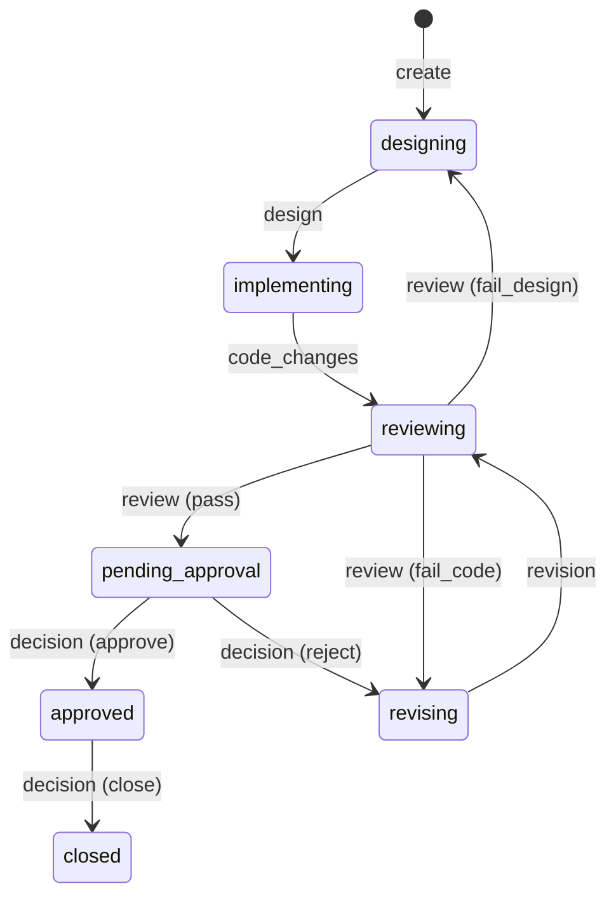

# TUT 系统设计文档

## 1. 概述

### 1.1 要解决的问题

让多个 coding agent（不同模型、不同工具）在同一项目中协作时，存在三个痛点：

- **上下文靠文件中转**：design.md / review.md 只传结论，推理过程和被放弃的方案全部丢失
- **流程靠手动驱动**：Review-修改循环通常 2-3 轮，每轮人工触发、手动调 prompt
- **工具之间隔离**：各 Agent session 互相看不到，没有统一的状态和编排入口

### 1.2 解决方案

**TUT（Take Ur Turn）**：以 Context Hub 为核心的多 Agent 协作系统——

- **Context Hub**：本地 MCP Server，Agent 间的共享记忆。上下文按任务、按版本 append-only 累积，**写入永不因流程原因被拒绝**，替代文件中转
- **状态投影**：任务状态（走到哪、该谁动）由版本序列经纯函数**派生**，Hub 不执法——流程规则不约束写入
- **人工审批**：review 通过后由人发布 decision 记录（approve / reject），人只做关键节点介入
- **Notifier**：轮询派生状态，该谁动时通知人，并交叉验证 Agent 是否真的交差

贯穿全文的架构原则：**Hub 只对记忆负责**。流程的执行（谁按下启动键、审批是否放行）属于消费侧——manual 模式的门是人，auto 模式的门是 Notifier 的启动检查。

各关键取舍已在相应章节就地陈述。

## 2. 整体架构

### 2.1 模块视图

系统五个模块：

| 模块 | 职责 | 展开 |
|------|------|------|
| **Context Hub** | 共享记忆（append-only 日志）+ 状态投影（派生视图）。对 Agent 暴露 MCP 工具，对 Notifier 暴露 GET /state | 第 3、4 节 |
| **coding agent** | 若干个，角色分三种：Architect、Executor、Reviewer——哪个 agent 担任哪个角色是指派而非固定绑定 | 第 5 节 |
| **Agent Host** | 承载本机 Agent 进程的宿主环境，履行两个可插拔角色——**信号源**（Agent 状态事件）+ **启动器**（拉起 Agent）；具体实现可替换（当前选型见第 8 章） | 第 7 节 |
| **Notifier** | 通知与流转中枢：常驻轮询派生状态，按 auto/manual 模式决定「谁按下启动键」，交叉验证 Agent 是否交差 | 第 6 节 |
| **Channel** | 通知输出端（本机桌面提醒 / webhook），触达人 | 8.3 |

### 2.2 数据流

三条流，对应「写、看、动」；部署形态单机团队同构：

```
┌───────────────── 本机 ×N（团队时每台机器结构相同）─────────────────┐
│                                                                  │
│  coding agent ──MCP 读写──► Context Hub ──► 存储（可插拔）         │
│       ▲                   （记忆 + 状态投影）  ├─ 本地 JSON（单机） │
│       │ 启动                      ▲           └─ 共享 repo（团队） │
│  Agent Host ──状态事件──► Notifier ─┘                             │
│  （信号源 + 启动器，可插拔）        │ 读取派生状态（GET /state）    │
│                                  │                               │
└──────────────────────────────────┼───────────────────────────────┘
                                   ▼ 通知
                              Channel ──► 人
         manual：人启动下一个 ｜ auto：Notifier 经启动器启动
```

- **写（记录）**：coding agent 经 MCP 往 Hub 追加记录——append-only，写入自由。协议用现成的开放标准（主流 Agent CLI 原生支持，工具 schema 即集成契约，不自研协议）；通知侧不走 MCP，读取只读的 GET /state 足够（见 4.3）
- **看（感知）**：Notifier 读取派生状态是主通道——人工 decision 等不产生事件的流转只有它能发现；信号源事件做追加触发与交叉验证。感知机制（轮询）及其理由见 6.1
- **动（行动）**：manual 模式人自己启动下一个 Agent，auto 模式 Notifier 经启动器（`launch.sh`）拉起——无论哪种，都先经 Channel 通知人

**部署形态**：单机时存储为本地 JSON，Hub 即事实源；团队时存储指向共享 context repo（仓库拓扑见 context-design.md 1.2），每台机器的 Hub 是远端事实源的本地视图——派生是纯函数，各机对同一份日志算出同一状态，不会分叉。两种形态下本机结构完全相同，Notifier 与 coding agent 无感知。启动方式为本地两条命令：`tut serve` 拉起 Hub（MCP + /state），`tut notify` 在专属 pane 常驻运行 Notifier（见 8.2）——不启动则没有任何常驻进程。

### 2.3 关键原则

- **流程真相以派生状态为准**：Notifier 不猜测该做什么，而是轮询 /state；Agent 终端状态（done/blocked）只作为辅助信号，用于交叉验证
- **Hub 只对记忆负责**：写入无条件追加，状态是日志的派生视图而非写入门槛——人为接管、流程异常都不会使记忆不可用
- **写入自由**：哪个 Agent 在什么时候写什么，由人和 Agent 自主决定；流程约束长在消费侧

## 3. 任务状态（核心机制：派生视图）

任务状态**不存储、不执法**，而是版本序列的派生视图：一个纯函数读任务的全量记录序列，输出 status、waiting_for 和 warnings。每次追加记录后重算（可缓存），随时可从日志全量重放。

### 3.1 派生规则

序列中依次出现以下记录时，派生状态按图流转（与状态机转换表同构，但语义是「计算」而非「放行」）：



此外，`decision(close)` 在**任意状态**都派生为 closed——人工有权随时终止任务，不需要先走完审批链。其余记录类型（note）不改变状态。

派生函数只消费影响状态折叠的字段（verdict / decision / ack / flow）。**cast 不参与状态派生**：它是路由参数（告诉启动器为各 role 拉谁），不是状态参数，也不约束谁能写记录——任务不维护角色名册的原则不变（见 4.1）。

**转换表按任务的 flow 选择**（flow 在 create 时确定、落 meta 后不可变，缺省 `full`）。full 即上图；direct 与 solo 的差异：

| 记录 | full（上图） | direct（repo 已有设计） | solo（小改动免审） |
|------|------------|----------------------|-------------------|
| create（空序列） | → designing | → **implementing** | → designing |
| design | designing → implementing | **implementing → implementing**（参考记录，不转态）；其余态表外 | designing → implementing（保留） |
| code_changes | implementing → reviewing | 同 full | implementing → **pending_approval** |
| review(pass/fail_code) | reviewing → pending_approval / revising | 同 full | **表外**（落盘 + needs_attention——免审流程里发 review 是越轨，应当可见） |
| review(fail_design) | reviewing → designing | **表外**（direct 无 designing 态；免设计流程中设计前提被推翻由人裁决） | 表外（同上） |
| revision | revising → reviewing | 同 full | **表外**（revising 不可达） |
| decision(reject) | pending_approval → revising | 同 full | pending_approval → **implementing**（打回重做） |
| 其余（approve/close/note/ack/异常） | 现行语义 | 同 full | 同 full |

派生函数签名相应扩展为 `derive(taskId, records, flow?)`——纯函数性质不变，flow 缺省即 full（存量任务零影响）。

`waiting_for` 同为派生：`pending_approval / needs_attention` → human，`closed` → none，其余 → 对应的下一角色（如 implementing → agent:executor）。注意这只是**路由建议**，不是指令——人可以让任何 Agent 接任何一手。

**project scope 是派生的例外**（scope 模型见 context-design 2.1）：派生函数跳过它——它没有 status 与 waiting_for，也不出现在 /state。

### 3.2 异常序列的处理

needs_attention 是**叠加在 status 上的布尔标志，不是状态机的第七个状态**——任何状态都可能与它共存，复位也不改变当前 status。

表外组合（如 designing 状态出现 review）**不拒绝写入**：记录照常落盘，但不参与状态折叠，派生结果记入 warnings 并置 `needs_attention`。publish 的返回、/state、通知都会暴露 warnings 和 needs_attention，提醒人处置。

**closed 是吸收态**：任务派生为 closed 后，note 照常落盘且不改变状态；其他类型的记录同样落盘，但状态保持 closed 并置 needs_attention。

needs_attention 的复位机制属于实现细节，但有一条硬约束：**复位动作本身必须是一条日志记录**（如带确认标记的 note 或 decision）——派生函数只认日志，任何进程内的「已确认」标志重算时都会丢失。

### 3.3 人工审批

review pass 派生出 `pending_approval` 后，需要一条**人**发布的 decision 记录（approve / reject）才能继续派生；close 则在任意状态有效（见 3.1）。decision 是记录不是硬门——放行的实际约束在消费侧：auto 模式下 Notifier 检查「无 decision 不启动」，manual 模式下人本身就是门。

## 4. Context Hub 设计

### 4.1 MCP 工具（5 个）

**context.create**

```
输入：{ title, description, creator, role, flow?, cast? }   flow ∈ "full" | "direct" | "solo"，缺省 full；
                                                             cast ∈ { architect? / executor? / reviewer? → agent 名 }，
                                                             部分指定合法（缺的 role 回落默认阵容）
输出：{ task_id, status, version: 0 }                status 按 flow 派生：full/solo → "designing"，direct → "implementing"
```

flow 与 cast 落 meta 后均不可变（无写入路径，构造性不可变），变更 = 新任务。

task_id 由 Server 生成（slug 化 title + 必要时加短后缀）。role 是创建者自述标签，任务不维护参与角色名册。**cast 是路由参数不是参与名册**：只影响启动器为各 role 拉谁（消费侧解析链见 6.2），不约束谁能写记录（写入自由不变）——CLI 通道为 `tut create --cast executor=pi,reviewer=codex`。

**context.publish**

```
输入：{ task_id, role, content_type, payload, agent?, model?, expected_version? }
输出：{ task_id, version, status, needs_attention?, warnings? }
```

任何 content_type 都接受，无条件追加。「无条件」指不做流程、角色、时序校验；基本合法性（task 存在、必填字段完整）仍校验并返回错误。role / agent / model 都是自述元数据（谁、以什么身份写的），供追溯与路由建议——agent / model 均可缺省（Hub 以 stateless HTTP 服务，无会话身份可记，agent 缺省时字段留空）。expected_version 用于乐观并发（见 4.2）。

**context.read**

```
输入：{ task_id, since_version? }
输出：{ task_id, title, description, flow, cast?, status, versions: [...] }
```

description 随 read 暴露（加法修订）——direct/solo 流程里任务要求不经 design 记录承载，executor 读日志即见需求。`flow` 总出现且缺省规范化为 `"full"`、`cast?` 有才出现（加法修订）；project scope 两者皆不出现。

status 为派生结果。

**context.list**

```
输入：{ status? }
输出：{ tasks: [...] }
```

结果包含 project scope（带 `scope: "project"` 标识，无 status——它是派生函数跳过的特殊 scope，见 context-design 2.1）。任务条目另携 `flow`（总现、规范化 `"full"`）与 `cast?`（有才现），与 context.read 同形。不提供 role 过滤——role 只是记录级标签，任务没有角色名册，没有可过滤的对象；需要按「某角色参与过」筛选时，消费方拿全量列表后按记录元数据自查。

**context.decide**

```
输入：{ task_id, decision, by }
  decision: "approve" | "reject" | "close"
输出：{ task_id, status }
```

人工审批/关闭的入口，效果等于追加一条 decision 记录（role 固定为 `human`，`by` 记录实际操作者）。可以通过任意 MCP 客户端调用（命令行或所在 IDE 的 Agent）；也因此 decision 无法验证「确实来自人」，这层保证在消费侧——manual 模式人本身就是门，auto 模式 Notifier 检查「无 decision 不启动」（见 3.3）。

### 4.2 存储

文件结构，零依赖：

```
.context-hub/
├── config.json                  # 全局配置（含 flow_mode，见 6.2）
├── index.json                   # 任务索引（list 查询用）
└── tasks/
    └── auth-refactor/
        ├── meta.json            # 标题、创建者、版本号（status 是派生缓存，可随时重算）
        ├── v001.design.json
        ├── v002.code_changes.json
        └── ...
```

单条记录 schema：version / task_id / role / agent? / model? / content_type / timestamp / payload；agent / model 为可选的自述元数据，来源见 4.1，payload 结构见 4.5。

**并发控制**：meta.json 读写走单写者队列（进程内 async mutex）+ 版本号乐观校验（publish 时携带 expected_version 可选参数）。单进程运行，不做跨进程文件锁。

### 4.3 只读状态接口（给 Notifier 用）

MCP 之外暴露一个普通 HTTP GET：

```
GET /state
→ { flow_mode: "manual" | "auto",
    notify?: { channels: [...], webhook_url: "..." },   // 可选，见下注
    tasks: [ { task_id, title, status, updated_at, needs_attention: bool,
               waiting_for: "human" | "agent:<role>" | "none",
               version: number, flow: "full"|"direct"|"solo", cast?: {...} } ] }   // 见下注（加法修订）
```

status / waiting_for / needs_attention 为派生结果（见第 3 节；project scope 不出现在 /state——它没有可派生的状态）。任务条目原六字段形状冻结，`version`、`flow`（总现、规范化 `"full"`）、`cast?`（有才现）均为**加法修订**，同时外泄到 context.read / context.list 的 MCP 输出面（条目同名字段，schema 只增不改）；Hub 只暴露原始 cast，不替消费方解析路由（解析链在消费侧，见 6.2）。顶层 `notify` 键同为**加法修订**：回显 config.json 的 `notify` 字段（Channel 配置，见 8.3），config 缺省或损坏时键不出现、接口不报错——Notifier 每轮轮询随取随用，配置变更下个周期生效，不为读配置增加文件依赖。Notifier 常驻轮询这个接口（默认间隔 5s，可配置，见 6.1），对比上一次快照，发现 `waiting_for` 变化或 `needs_attention` 置位即发通知。一个只读 HTTP 接口就够了，Notifier 不需要 MCP 客户端能力。

### 4.4 pane ↔ task 映射

两个零机制约定：

- **工作 pane 标题 = task_id**（pane 由 Agent Host 提供，见第 7 章），通知时直接带上 pane 名。
- **路由 pane 标签 = agent 名**：在场每位 Agent 各一个 pane，标签即 agent 名（如 `pi` / `codex`）。过渡期兼容 legacy 标签（workspace.json 的 label 字段值，如 arch / exec / review）：启动器查找顺序为 agent 名 → legacy 标签（命中时提示 rename）→ 按需供给（见 7.2）；legacy 级待后续清理统一退役。已知撞名边缘：agent 名恰等于某在役 task_id 时，事件反查的工作 pane 直查优先——概率极低，声明优先级即可，不做防撞机制。

如果不够用再引入显式注册。

### 4.5 上下文（payload）结构

payload 采用**薄信封 + Markdown 正文**：结构化字段只保留系统必需的（summary / body / verdict——其中 verdict 是派生函数消费的唯一字段）和读者高频使用的（commits / ref_version），完整推理过程保留在 Markdown body 里。核心原则：**外层结构化（谁、何时、什么类型、第几版、针对谁），内层完整叙述**——payload 的读者是下一个 Agent 和人，不是 Server。

字段定义、内容模型（task / project 两种 scope）、各 content_type 的 body 模板、管理方式和演进策略见 [context-design.md](context-design.md)。

## 5. Agent Skills

三个 skill，按角色一 Role 一份，随仓库提供（`skills/` 目录），内容教 Agent 何时读写 Hub：

**architect.md**（供担任 Architect 角色的 Agent 使用）
- 接到设计任务 → `context.create` → 写设计 → `context.publish(design)`

**reviewer.md**（供担任 Reviewer 角色的 Agent 使用）
- 被（人工）指派 review → `context.read` 全量上下文 → review → `context.publish(review)`，verdict 必须取 pass / fail_code / fail_design 之一
- 收到 revising 完成的信号 → 重新 review

**executor.md**（供担任 Executor 角色的 Agent 使用）
- `context.list` 找到 status=implementing/revising 的任务 → `context.read` → 编码实现（必须跑测试）→ `context.publish(code_changes / revision)`，payload 引用 commits、附验证结果
- 实现中途的补充说明用 `note`，不影响派生状态

接手任务时的读序（三层各答一个问题，见 context-design.md 2.6）：读 git 权威文档（「现在是什么样、该怎么做」）→ 读 project scope 决策流（「为什么」）→ 读任务日志（「进行到哪」）。

skill 是**行为模板而非身份绑定**：教的是「干这类活时怎么用 Hub」，任何 Agent 加载后都能干这类活。各 content_type 的 body 写作模板定义在 [context-design.md](context-design.md) 2.4 节，skill 引用该模板。

## 6. Notifier：通知与流转

Notifier 是通知与流转的中枢：常驻轮询派生状态、按流转模式行动。Agent Host（第 7 章）的信号源事件是它的追加输入。

### 6.1 通知逻辑

Notifier 是**常驻轮询进程**，信号源事件只是追加的触发——轮询是主通道，因为人工 decision、一切不经过本机 Agent 的流转都不产生事件，只有轮询能发现：

```
Notifier 主循环（默认 5s，可配置）
  → GET http://localhost:3001/state，与本地快照对比
  → waiting_for 变了 → 按 6.2 的流转模式处理
  → needs_attention 置位 → 通知异常序列，提示人工处置

信号源事件 agent.done / agent.blocked（追加触发，见第 7 章）
  → 立即执行一次上述对比（提前于下个轮询周期）
  → 并做交叉验证：Agent 终端状态与 Hub 不一致时（Agent 说 done 但没 publish）
      → 通知 "Agent X 停止但未发布上下文"，提示人工检查
```

交叉验证：**用 Hub 状态验证 Agent 是否真的交差了**（子 Agent 偷懒问题的兜底）。

### 6.2 流转模式（auto / manual）

「事件驱动下一个 Agent 开工」有全局开关，由 Hub 配置（config.json 的 `flow_mode`），通过 /state 暴露给 Notifier。**切换入口是 `tut mode <manual|auto>` 子命令**：经 `POST /mode` 由 Hub 完成**保键读改写**（未知键如 `notify` 全保留）后 temp+rename 原子落盘 config.json，非法值 400；Hub 每次响应 /state 时现读当前值——切换在下个轮询周期生效，无需重启。此通路要求 Hub 在运行（`tut mode` 是 HTTP 客户端；6.1 本就假设 serve 常驻）。

| 模式 | waiting_for 变化时 Notifier 的行为 |
|------|---------------------------|
| **manual**（默认） | 只经 Channel 通知人（含 task、状态、该谁动），**人同意后**下一个 Agent 才开始：人可以直接去目标 pane 发 prompt，或用 `tut start-next <task_id>` 一键经启动器启动下一个 |
| **auto** | Notifier 经启动器（`scripts/launch.sh`，见 7.2）直接在目标 pane 启动下一个 Agent，同时发通知告知 |

auto 模式启动前的检查是流程执法的唯一所在（三项）：**① review pass 但没有 decision 记录、② needs_attention 置位、③ 目标 role 不在启动白名单**（config.json 的 `auto.launch_roles`，经 /state 的 `auto` 键暴露，缺省空 = 全部回落）——任一命中则 Notifier 不自动启动，转通知人。检查顺序：判门 → 白名单 → 查重（launch note）→ 前置检查 → 落痕 → 启动；**白名单未过不落 launch 痕**（不阻碍人的 `tut start-next`），**前置检查失败也无痕**（解析不出目标 agent / agent 不在 PATH → 报错退出，重试自然、无需 --force；herdr 层失败仍发生在落痕后 → 恢复用 `--force`）。manual 模式下人本身就是门。

manual 模式下 Notifier 同样持有启动能力但不使用——auto/manual 切换只改 Notifier 的一个分支，不改 Hub；流程真相仍在派生状态，模式只决定「谁来按下启动键」。**role → agent 的路由解析链**（单一链、两个启动门共用）：**task cast（/state 条目）→ scripts/workspace.json 的 roles.<role>.agent → scripts/routes.json 值（legacy，值语义当 agent 名）→ DEFAULT_ROLES**。workspace.json 降级为**默认阵容**（label 字段弃用读侧忽略、`tut assign` 改的是默认阵容；文件形状不变，存量零迁移；字段清理与 routes.json 退役统一留待后续清理）；「一 Agent 多帽」是一等表达（多个 role 指向同一 agent）。TS 侧实现为 workspace.ts 的 `resolveAgent` / launch.ts 的 `resolveLaunchTarget`（tut start-next 与 Notifier auto 门共用），launch.sh 内嵌镜像实现（既有双实现格局，后续统一）。

`tut start-next <task_id>` 子命令是人工确认入口：读当前 waiting_for → 前置检查（解析目标 agent + PATH）→ 经启动器（`launch.sh <task_id> <role> <agent>`，见 7.2）启动对应的下一个 Agent——它和 auto 模式走同一条启动通路与解析链，只是按键者是人。**`tut up` 已退化为电源开关**：只供给 hub + notify pane，不再预供 role pane——agent pane 由启动器在交接时按需供给（见 7.2），「多开 agent = 闲置零成本」由此成立。

## 7. Agent Host：信号源与启动器

Agent Host 是承载本机 Agent 进程的宿主环境。架构对它的依赖是**两个角色**，不是任何具体组件——角色是结构性需求，实现是可替换的选择（当前选型见第 8 章）。

### 7.1 两个角色

**Agent 状态信号源**：working / blocked / done 事件的唯一来源。Hub 原理上看不见 Agent 的运行态——Agent 卡在权限确认、说 done 但没交差、进程崩了，在 /state 里全都表现为「waiting_for 不变」，只能靠超时兜底且分不清原因。要完整的协作体验（blocked 检测、交叉验证、低延迟交接），必须有一个能观测本机 Agent 终端状态的信号源。

**启动器**：auto 模式与 start-next 的执行手——在指定上下文里拉起 Agent。Hub 只出判据（waiting_for），不出手。

### 7.2 契约（可插拔边界）

两个角色各对应一个极简契约，粘合脚本就是边界的物化：

| 角色 | 契约 | 当前绑定 |
|------|------|---------|
| 信号源（in） | 事件投给统一入口：`scripts/on-agent-event.sh <event> <agent> <pane>`，event ∈ working / blocked / done | Herdr 插件投递 |
| 启动器（out） | 经统一封装启动：`scripts/launch.sh <task_id> <role> [<agent>]`（轮次交接，auto 模式 / start-next 用；第三参为解析后的目标 agent——调用方（cli / notifier）经 6.2 解析链得出后显式传入，缺省时脚本自行解析：`GET $TUT_HUB_URL/state` 拿 cast → 文件链，hub 不可达回落默认阵容并 stderr 提示）；`scripts/launch.sh --new <label> "<text>"`（新任务接单投递，`tut new` 用，label = architect 的 agent 名）。**按需供给**：目标 agent 的 pane 不在场时现场诞生——`command -v <agent>` 前置，基准 pane（`$TUT_SPLIT_BASE` env → pane list 首个）split → `herdr tab create --label <agent>` → `pane move --tab <tab> --split down` → `pane rename <agent>` → `pane run <agent>`；hub 不可达时 cast 读不到，回落文件链。**投递机制**（见 7.2.1）：prompt 不用 `pane run` 投——其打字+提交走括号粘贴启发式，与正在启动的 TUI 存在时序竞争；改为就绪门控的显式投递（见 7.2.1）。内部调容器命令（herdr 0.8 语法） | `herdr pane split` / `pane send-text` / `pane send-keys` 等 |

任何实现只要履行契约即可接入：更换终端容器、或将来的 Agent 直报，都只改这两个粘合脚本——Hub、派生、通知逻辑不动。

**接线安装（一次性环境配置，不随代码分发）**

Notifier 的辅通道（blocked 即时告警、done 交叉验证、working 刷新 stall 计时）依赖 Herdr 把 pane 内 Agent 的状态变化投给 `scripts/on-agent-event.sh`。安装步骤：

1. 建插件目录 `~/.config/herdr/plugins/tut-notify/`，放两个文件。`herdr-plugin.toml`（路径换成实际部署路径，herdr 不做 shell 展开、必须绝对路径）：

   ```toml
   id = "tut.notify"
   name = "TUT agent events"
   version = "0.1.0"
   min_herdr_version = "0.7.0"
   description = "Forward agent status changes to TUT on-agent-event.sh"
   platforms = ["macos", "linux"]

   [[events]]
   on = "pane.agent_status_changed"
   command = ["~/.config/herdr/plugins/tut-notify/hook.sh"]
   ```

   `hook.sh` 订阅 `pane.agent_status_changed`（payload 含 pane_id / workspace_id / agent_status / agent，不含 pane 标签与 task_id），负责：① 状态映射——working / blocked / done 直通，idle 仅在前一状态是 working 时映射为 done（聚焦 pane 回合结束报 idle；其余 idle 忽略，避免假告警）；② 经 `herdr pane get` 把 pane_id 解析成标签；③ 调 `on-agent-event.sh <event> <agent> <标签>`。每 pane 上一状态记在 `HERDR_PLUGIN_STATE_DIR`（缺省回落 /tmp，回落时仅损失被聚焦 pane 的交叉验证）。
2. 激活：`herdr plugin link ~/.config/herdr/plugins/tut-notify`（用户级全局，一次生效），`herdr plugin list` 应见 tut.notify enabled。
3. 验证：起 hub + notifier 后在任一 pane 跑一回合 Agent，notify pane 日志应出现事件行。

事件 → 任务映射按 agent 身份：herdr 事件不带 task_id，Notifier 两级反查——① pane 标签 = task_id 直接命中；② 标签 → agent 身份匹配「当前正等该 role 且路由到该 agent 的任务」（task cast ?? 默认阵容），唯一命中、多个取 updated_at 最新、没有则如实降级（blocked 仍告警、done 触发即时对比、working 不刷新计时；轮询主通道不受影响）。

#### 7.2.1 投递机制：就绪门控 + 显式提交

prompt 不用 `pane run` 一体投递：其「打字 + 回车」走终端括号粘贴（bracketed paste）启发式，与正在启动的 TUI（模式切换中）存在时序竞争，回车可能丢失。改为三步显式投递（`--new` 与轮次交接一致）：

1. **就绪探测**（仅 born pane；存量 pane 的 TUI 本就在场，直投）：轮询 `herdr pane read <pane> --source visible --lines 40`，要求输出相对基准（`pane run <agent>` 返回瞬间的 shell 回显）发生变化且连续两次采样稳定，且不早于下限等待——即接收方 UI 已绘制、输入循环已活。参数：`TUT_READY_FLOOR_MS`（默认 1500）、`TUT_READY_TIMEOUT_MS`（默认 15000，到点照投并 stderr 提示）、`TUT_READY_POLL_MS`（默认 250）。
2. **投递**：`herdr pane send-text <pane> "<prompt>"`——字面文本，不产生粘贴标记。
3. **提交**：`herdr pane send-keys <pane> Enter`——离散回车。

**herdr 0.8 集成注记**（集成约束，上述设计由此而来）：

- `pane read` 的 `recent` / `recent-unwrapped` 源在刚诞生的 pane 上不可靠（可能恒返空）；`visible` 源从诞生起可靠——探测一律用 `visible`。
- 门控信号是「屏幕内容相对回显基准发生变化并稳定」，不依赖接收方类型；投递与提交是普通 pty 写入，对 canonical 读取器（普通 CLI）与 raw-mode TUI（交互式 Agent CLI）同样成立。
- 供给序列关键命令的回包形状：`pane split` → `{"result":{"pane":{"pane_id",…}}}`、`pane move --tab` → `{"result":{"move_result":{…}}}`、`pane rename` → `{"result":{"pane":{"pane_id","label"}}}`——launch.sh 的容错解析与此一致（move / rename 仅以退出码判成败，不解析响应体）。

### 7.3 替代与演进

- **换容器**：tmux/zellij 等终端容器的插件理论上可履行同样契约，改动仅限粘合脚本
- **Agent 直报**：Agent 自身经 lifecycle hooks 上报状态，绕过终端容器——依赖各 Agent CLI 的集成能力，是后续路径
- **Hub repo 化之后**：Herdr 从必需的粘合层降级为可选的本机增强——通知主通道（轮询本地 /state）不依赖它；不用的代价是 blocked 检测与交叉验证退化为超时兜底、auto 启动需要另配启动器。能力清单不减，必要性下降

## 8. 技术选型（当前实现）

本章集中记录当前的具体选型——它们都是可替换的实现细节，不属于架构（各模块的架构语义见前述各章）。

### 8.1 Agent Host：Herdr

Herdr 履行信号源与启动器两个契约（见 7.2）：

- 所有 Agent 在同一窗口管理，sidebar 实时显示各 Agent 状态
- 插件系统提供事件投递能力（履行信号源契约）
- `herdr pane run` 在指定 pane 执行命令（履行启动器契约）
- 状态检测两层：screen manifest（规则匹配终端输出）+ lifecycle hooks（Agent 集成直报，更精准，取决于各 Agent CLI 是否提供）；只有 screen manifest 时 blocked 可能偶尔漏判

### 8.2 Notifier：`tut notify` 子命令

Notifier 实现为 tut CLI 的子命令，部署形态是开一个专属 pane 常驻运行 `tut notify`。好处：与各 agent 同一窗口管理、崩溃在 sidebar 可见、stdout 即运行日志、团队场景每机结构同构。注意：该 pane 不适用 pane 标题 = task_id 约定（4.4），也不参与 auto 模式的 role → pane 路由。

### 8.3 Channel：可配置的输出端

Channel 是抽象的通知输出端，Notifier 可配置一个或多个：

- **本机桌面提醒**：人在机器前时最直接、零网络依赖——notifier 是本机进程，直接调系统通知（macOS osascript / Linux notify-send / 终端 bell）；Herdr 若提供桌面提醒能力亦可接入
- **飞书/Telegram webhook**：人离开机器、或团队场景

## 9. 工程约定

### 9.1 技术栈与代码结构

- TypeScript + Node ≥ 20，@modelcontextprotocol/sdk（Streamable HTTP transport，单端口同时服务 MCP 和 /state）

```
take-ur-turn/
├── design/
│   ├── system-design.md               # 本文档
│   ├── context-design.md              # 上下文设计（放什么、怎么管理）
├── skills/                # Agent skill 文本
├── scripts/               # on-agent-event.sh / launch.sh 等粘合脚本（第 7 章）
├── src/
│   ├── cli.ts             # tut CLI 入口：14 个子命令（全量语法见 src/cli.ts 顶部 USAGE）
│   ├── server.ts          # tut serve：启动 MCP + /state（Notifier 由 tut notify 独立运行）
│   ├── mcp.ts             # 5 个 MCP 工具的 schema 和 handler
│   ├── state-machine.ts   # 派生规则（纯函数）+ waiting_for 计算
│   ├── store.ts           # 文件读写、版本、并发队列
│   ├── config.ts          # .context-hub/config.json 读写（notify / auto 白名单 / flow_mode）
│   ├── notifier.ts        # tut notify：轮询 /state、判门、通知、调 launch（第 6 章）
│   ├── channels.ts        # 通知输出端（desktop 降级链 / webhook）
│   ├── hub-client.ts      # tut CLI → Hub 的 HTTP 薄客户端（MCP 工具的 CLI 等价层）
│   ├── launch.ts          # 启动目标解析（cast → workspace → 默认阵容）+ 启动标记
│   ├── workspace.ts       # role → label/agent 映射（workspace.json → routes.json → 默认）
│   ├── http.ts            # GET /state + POST /mode
│   └── types.ts           # 跨模块冻结契约（seam 类型）
└── test/                  # vitest：派生规则全序列 + store 并发
```

### 9.2 测试要求

- vitest。派生函数按纯函数测：转换表全覆盖、异常序列归化（needs_attention）、同输入同输出（幂等重放）

