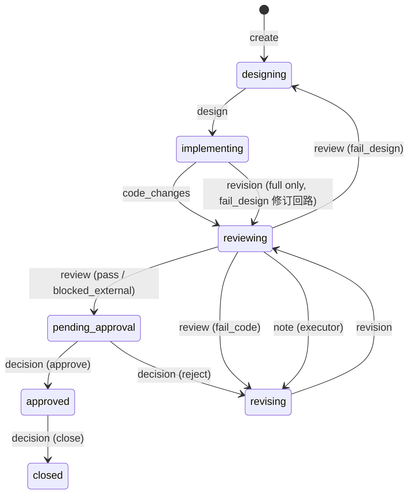

# TUT 系统设计文档

## 1. 概述

### 1.1 要解决的问题

让多个 coding agent（不同模型、不同工具）在同一项目中协作时，存在三个痛点：

- **上下文靠文件中转**：design.md / review.md 只传结论，推理过程和被放弃的方案全部丢失
- **流程靠手动驱动**：Review-修改循环通常 2-3 轮，每轮人工触发、手动调 prompt
- **工具之间隔离**：各 Agent session 互相看不到，没有统一的状态和编排入口

### 1.2 解决方案

**TUT（Take Ur Turn）**：以 Context Hub 为核心的多 Agent 协作系统——

- **Context Hub**：本地 MCP Server，Agent 间的共享记忆。上下文按任务、按版本 append-only 累积，**写入永不因流程原因被拒绝**，替代文件中转
- **状态投影**：任务状态（走到哪、该谁动）由版本序列经纯函数**派生**，Hub 不执法——流程规则不约束写入
- **人工审批**：review 通过后由人发布 decision 记录（approve / reject），人只做关键节点介入
- **Notifier**：轮询派生状态，该谁动时通知人，并交叉验证 Agent 是否真的交差

贯穿全文的架构原则：**Hub 只对记忆负责**。流程的执行（谁按下启动键、审批是否放行）属于消费侧——manual 模式的门是人，auto 模式的门是 Notifier 的启动检查。

各关键取舍已在相应章节就地陈述。

## 2. 整体架构

### 2.1 模块视图

系统五个模块：

| 模块 | 职责 | 展开 |
|------|------|------|
| **Context Hub** | 共享记忆（append-only 日志）+ 状态投影（派生视图）。对 Agent 暴露 MCP 工具，对 Notifier 暴露 GET /state | 第 3、4 节 |
| **coding agent** | 若干个，角色分三种：Architect、Executor、Reviewer——哪个 agent 担任哪个角色是指派而非固定绑定 | 第 5 节 |
| **Agent Host** | 承载本机 Agent 进程的宿主环境，履行两个可插拔角色——**信号源**（Agent 状态事件）+ **启动器**（拉起 Agent）；具体实现可替换（当前选型见第 8 章） | 第 7 节 |
| **Notifier** | 通知与流转中枢：常驻轮询派生状态，按 auto/manual 模式决定「谁按下启动键」，交叉验证 Agent 是否交差 | 第 6 节 |
| **Channel** | 通知输出端（本机桌面提醒 / webhook），触达人 | 8.3 |

### 2.2 数据流

三条流，对应「写、看、动」；部署形态单机团队同构：

```
┌───────────────── 本机 ×N（团队时每台机器结构相同）─────────────────┐
│                                                                  │
│  coding agent ──MCP 读写──► Context Hub ──► 存储（可插拔）         │
│       ▲                   （记忆 + 状态投影）  ├─ 本地 JSON（单机） │
│       │ 启动                      ▲           └─ 共享 repo（团队） │
│  Agent Host ──状态事件──► Notifier ─┘                             │
│  （信号源 + 启动器，可插拔）        │ 读取派生状态（GET /state）    │
│                                  │                               │
└──────────────────────────────────┼───────────────────────────────┘
                                   ▼ 通知
                              Channel ──► 人
         manual：人启动下一个 ｜ auto：Notifier 经启动器启动
```

- **写（记录）**：coding agent 经 MCP 往 Hub 追加记录——append-only，写入自由。协议用现成的开放标准（主流 Agent CLI 原生支持，工具 schema 即集成契约，不自研协议）；通知侧不走 MCP，读取只读的 GET /state 足够（见 4.3）
- **看（感知）**：Notifier 读取派生状态是主通道——人工 decision 等不产生事件的流转只有它能发现；信号源事件做追加触发与交叉验证。感知机制（轮询）及其理由见 6.1
- **动（行动）**：manual 模式人自己启动下一个 Agent，auto 模式 Notifier 经启动器（TS launcher，`scripts/launch.sh` 为兼容 shim，见 7.2）拉起——无论哪种，都先经 Channel 通知人

**部署形态**：单机时存储为本地 JSON，Hub 即事实源；团队时存储指向共享 context repo（仓库拓扑见 context-design.md 1.2），每台机器的 Hub 是远端事实源的本地视图——派生是纯函数，各机对同一份日志算出同一状态，不会分叉。两种形态下本机结构完全相同，Notifier 与 coding agent 无感知。启动方式为本地两条命令：`tut serve` 拉起 Hub（MCP + /state），`tut notify` 在专属 pane 常驻运行 Notifier（见 8.2）——不启动则没有任何常驻进程。

### 2.3 关键原则

- **流程真相以派生状态为准**：Notifier 不猜测该做什么，而是轮询 /state；Agent 终端状态（done/blocked）只作为辅助信号，用于交叉验证
- **Hub 只对记忆负责**：写入无条件追加，状态是日志的派生视图而非写入门槛——人为接管、流程异常都不会使记忆不可用
- **写入自由**：哪个 Agent 在什么时候写什么，由人和 Agent 自主决定；流程约束长在消费侧

## 3. 任务状态（核心机制：派生视图）

任务状态**不存储、不执法**，而是版本序列的派生视图：一个纯函数读任务的全量记录序列，输出 status、waiting_for 和 warnings。每次追加记录后重算（可缓存），随时可从日志全量重放。

### 3.1 派生规则

序列中依次出现以下记录时，派生状态按图流转（与状态机转换表同构，但语义是「计算」而非「放行」）：



此外，`decision(close)` 在**任意状态**都派生为 closed——人工有权随时终止任务，不需要先走完审批链。note 原则上不改变状态，**唯一例外**：`reviewing` 态下 role=executor 的 note 派生回 `revising`——executor 在评审等待期开口（发现自己交付的问题、要补充材料或先行修改），工人直觉上就是收回回合。约束四条：仅 `reviewing` 态生效（其余态的 note 照旧不转态——implementing 中的中途补充是常态）；仅 role=executor（reviewer 的补充说明、architect 与人的记录不走此门）；ack note（`payload.ack=true`）一律不转态——异常处置确认的语义优先于回合收回；closed 吸收态优先，例外在 closed 下不生效。收回后照常以 revision 交付（无需改代码时 revision 说明即可），回到 reviewing 由 Reviewer 重审。role 是自述标签，照常被信任——与 verdict / decision 同一信任模型（Hub 不执法，见 2.3）。规则对全部日志统一生效：派生是记录序列的纯函数，重放按同一规则逐条折叠。

`review` 的 verdict 词表为四档：`pass`（达标且验证完成）｜`blocked_external`（**代码达标、验证卡在外部条件**——真机 / 部署 / 跨系统依赖等 review 回合内无法完成的验证）｜`fail_code`（代码问题，打回修）｜`fail_design`（设计问题，打回重设计）。`blocked_external` 与 `pass` 派生同路进 `pending_approval`：外部验证的执行、委托或豁免正是审批节点上人的职责——approve 即明知外部验证未决而接受（或人先完成验证再拍板），reject 可把补验路径写进理由。两档差别在通知语义与人的决策依据，不在派生路径；词表外的值仍走 `INVALID_VERDICT`（3.2）。

派生函数只消费影响状态折叠的字段（verdict / decision / ack / flow，外加 note 例外行的 role）。**cast 不参与状态派生**：它是路由参数（告诉启动器为各 role 拉谁），不是状态参数，也不约束谁能写记录——任务不维护角色名册的原则不变（见 4.1）。

**转换表按任务的 flow 选择**（flow 在 create 时确定、落 meta 后不可变，缺省 `full`）。full 即上图；direct 与 solo 的差异：

| 记录 | full（上图） | direct（repo 已有设计） | solo（小改动免审） |
|------|------------|----------------------|-------------------|
| create（空序列） | → designing | → **implementing** | → designing |
| design | designing → implementing | **implementing → implementing**（参考记录，不转态）；其余态表外 | designing → implementing（保留） |
| code_changes | implementing → reviewing | 同 full | implementing → **pending_approval** |
| review(pass / blocked_external / fail_code) | reviewing → pending_approval（pass、blocked_external 同目标）/ revising（fail_code） | 同 full | **表外**（落盘 + needs_attention——免审流程里发 review 是越轨，应当可见） |
| review(fail_design) | reviewing → designing | **表外**（direct 无 designing 态；免设计流程中设计前提被推翻由人裁决） | 表外（同上） |
| note（reviewing 态，role=executor，非 ack） | reviewing → revising | 同 full | 行不可达（solo 无 reviewing 态；其余 note 照旧不转态） |
| revision | revising → reviewing；implementing → reviewing（典型场景是 fail_design 修订回路：设计打回重设计落地后，executor 按信封纪律（修订轮以 revision 交付）以 revision 交付修订；派生无历史，implementing 收 revision 一律入行，不以回路前史为门） | revising → reviewing；implementing 下**表外**（fail_design 回路不存在） | **表外**（revising 不可达，无 review 修订回路） |
| decision(reject) | pending_approval → revising | 同 full | pending_approval → **implementing**（打回重做） |
| 其余（approve/close/note/ack/异常） | 现行语义（note 默认不转态，唯一例外见 note 行） | 同 full | 同 full |

派生函数签名相应扩展为 `derive(taskId, records, flow?)`——纯函数性质不变，flow 缺省即 full（存量任务零影响）。

`waiting_for` 同为派生：`pending_approval / approved / needs_attention` → human（approved 后 close 与否仍等人拍板），`closed` → none，其余 → 对应的下一角色（如 implementing → agent:executor）。注意这只是**路由建议**，不是指令——人可以让任何 Agent 接任何一手。

**project scope 是派生的例外**（scope 模型见 context-design 2.1）：派生函数跳过它——它没有 status 与 waiting_for，也不出现在 /state。

### 3.2 异常序列的处理

needs_attention 是**叠加在 status 上的布尔标志，不是状态机的第七个状态**——任何状态都可能与它共存，复位也不改变当前 status。

表外组合（如 designing 状态出现 review）**不拒绝写入**：记录照常落盘，但不参与状态折叠，派生结果记入 warnings 并置 `needs_attention`。publish 的返回暴露 warnings 和 needs_attention——这是 warning 明细唯一的公开读取入口（落盘 meta.json 的派生缓存仅供直接调试）；/state 与 context.list 只暴露 needs_attention 布尔。错过 publish 即时响应时，事后凭 needs_attention 置位经 context.read / `tut read` 查看触发异常的记录定位问题、提醒人处置——warning code 本身不随 read 暴露（read 暴露明细属加法契约，须另立代码任务，不在文档中预支）。

warnings 词表冻结于 `src/types.ts`（5 个）：`OUT_OF_TABLE`（表外组合，不折叠）、`CLOSED_ABSORB`（closed 后的非 note/close 记录，保持 closed）、`INVALID_VERDICT`（review 缺失/非法 verdict，不转态）、`VERSION_GAP`（版本跳号）与 `VERSION_DUPLICATE`（版本重复，两者折叠照常按版本序进行）——任何 warning 均置 needs_attention，waiting_for 随之为 human。

**closed 是吸收态**：任务派生为 closed 后，note 照常落盘且不改变状态；其他类型的记录同样落盘，但状态保持 closed 并置 needs_attention——例外是 decision(close) **幂等**：重复 close 只落盘，状态不变、不置 needs_attention。

needs_attention 的复位机制属于实现细节，但有一条硬约束：**复位动作本身必须是一条日志记录**（如带确认标记的 note 或 decision）——派生函数只认日志，任何进程内的「已确认」标志重算时都会丢失。

### 3.3 人工审批

review 的 `pass` / `blocked_external` 派生出 `pending_approval` 后，需要一条**人**发布的 decision 记录（approve / reject）才能继续派生——两档同门同责：`blocked_external` 与 `pass` 一样以 human decision 为唯一放行条件，无 decision 不启动，差别只在通知文案与人的决策依据（外部验证未决，见 3.1）；close 则在任意状态有效（见 3.1）。decision 是记录不是硬门——放行的实际约束在消费侧：auto 模式下 Notifier 检查「无 decision 不启动」（两档 verdict 一并拦，见 6.2），manual 模式下人本身就是门。

## 4. Context Hub 设计

### 4.1 MCP 工具（5 个）

**context.create**

```
输入：{ title, description, creator, role, flow?, cast?, checkout? }   flow ∈ "full" | "direct" | "solo"，缺省 full；
                                                             cast ∈ { architect? / executor? / reviewer? → AgentRoute }，
                                                             部分指定合法（缺的 role 回落默认阵容）；
                                                             checkout ∈ { kind: "current" } | { kind: "worktree", path, ref? }
                                                                  （worktree 必须带 path；ref 仅可随 path 作旁注，ref-only 在 create 即拒。CLI 字符串语法见下）
输出：{ task_id, status, version: 0, warning? }                status 按 flow 派生：full/solo → "designing"，direct → "implementing"
```

flow 与 cast 落 meta 后均不可变（无写入路径，构造性不可变），变更 = 新任务。

**CLI checkout 语法**：`tut create` 将下列形式规范化为同一 checkout 对象，均不创建 worktree：

- `--checkout current`；worktree 可用 `--checkout worktree:<path>`、`--checkout worktree=<path>` 或 `--checkout '<JSON 对象>'`（kind 为 current / worktree，后者带 path、可带 ref）。
- 路径简写：`--checkout <path>` 接受绝对路径、以 `./` / `../` 开头的相对路径、Windows 盘符路径与 UNC 路径；普通裸相对路径使用带 `worktree:` 前缀的明确形式。
- 分字段形式：`--checkout worktree --checkout-path <path> [--checkout-ref <ref>]`；只给 `--checkout-path` 也推定 worktree。`--checkout-kind current|worktree` 可显式指定 kind；`--worktree`、`--worktree-path`、`--worktree-ref` 分别是 checkout、checkout-path、checkout-ref 的别名，各对别名互斥。
- kind 冲突、path/ref 重复指定、current 搭配独立 path/ref 参数均拒绝；worktree 始终要求非空 path，ref 仅作旁注，不能独立启动。`repair-meta --checkout` 接受同一单值语法，不提供 create 的分字段旗标。

**checkout 语义**：`checkout` 是**建任务时冻结**的 TaskMeta 字段（同 flow/cast 不可变；缺省 `current`——字段不出现即沿用 Hub 所在 checkout）。MCP 输入是对象：`{ kind: "current" }`（沿用锚点 checkout）或 `{ kind: "worktree", path, ref? }`（指名一个**已建好**的 worktree，**必须带 path**；ref 仅可随 path 作旁注，ref-only 在 create 三面——store/MCP/CLI——即拒，因为启动器只能解析已存在的路径）；CLI 通道 `tut create --checkout current` / `--checkout worktree:<path>` 解析为同一对象落库（path 不存在时 create 给非阻断警告）。它是**元数据而非 git 生命周期指令**：TUT 只记录并消费它，绝不代跑 `git worktree`——建 worktree 是调用方的事。它也**不分裂 hubRoot**：记录仍写同一个 `.context-hub/`（四根分离见 7.2）——worktree 分支只切 checkoutRoot（轮次 pane 的 cwd），role→agent / naming 解析链的 L1 项目根仍取 `TUT_PROJECT_ROOT` ?? hubRoot。解析链的两级合并保持声明式：routingRoot 上的本地 `workspace.json` 值优先，缺失/损坏字段逐键回落 Hub 根声明（launch worktree 任务时 Hub 根作补充 L1 接入，见 6.2）。注意未显式设 `TUT_PROJECT_ROOT` 时 routingRoot 与 hubRoot 同根——实际生效的 L1 就是 Hub 根的 `workspace.json`；任务 worktree 自带的声明要参与 L1，须显式把 `TUT_PROJECT_ROOT` 指向它。

task_id 由 Server 生成（slug 化 title + 必要时加短后缀）。role 是创建者自述标签，任务不维护参与角色名册。**cast 是路由参数不是参与名册**：只影响启动器为各 role 拉谁（消费侧解析链见 6.2），不约束谁能写记录（写入自由不变）——CLI 通道为 `tut create --cast executor=pi --cast 'reviewer=codex --model <reviewer-model>'`。

`AgentRoute = string | AgentCommand`，其中 `AgentCommand = { agent: string, args: string[] }`。裸 agent 名继续按旧字符串落库；带参命令规范化为对象，args 顺序和值逐项保留。人类命令值只支持一个非空可执行词和若干非空参数词，TUT 只按空白分词并拒绝引号、反斜杠、变量、管道、重定向、glob、命令替换等 shell 语法；TUT 不解释命令内的 shell。`assign` 的 role 后剩余 argv 也按同一规则作为命令值。

**context.publish**

```
输入：{ task_id, role, content_type, payload, agent?, model?, expected_version? }
输出：{ task_id, version, status, needs_attention?, warnings? }
```

任何 content_type 都接受，无条件追加。「无条件」指不做流程、角色、时序校验；基本合法性（task 存在、必填字段完整）仍校验并返回错误。role / agent / model 都是自述元数据（谁、以什么身份写的），供追溯与路由建议——agent / model 均可缺省（Hub 以 stateless HTTP 服务，无会话身份可记，agent 缺省时字段留空）。expected_version 用于乐观并发（见 4.2）。

**context.read**

```
输入：{ task_id, since_version? }
输出：{ task_id, title, description, flow, cast?, checkout?, status, versions: [...] }
```

description 随 read 暴露（加法修订）——direct/solo 流程里任务要求不经 design 记录承载，executor 读日志即见需求。`flow` 总出现且缺省规范化为 `"full"`、`cast?` / `checkout?` 有才出现（加法修订）；project scope 两者皆不出现。

status 为派生结果。

**context.list**

```
输入：{ status? }
输出：{ tasks: [...] }
```

结果包含 project scope（带 `scope: "project"` 标识，无 status——它是派生函数跳过的特殊 scope，见 context-design 2.1）。任务条目另携 `flow`（总现、规范化 `"full"`）与 `cast?` / `checkout?`（有才现），与 context.read 同形。不提供 role 过滤——role 只是记录级标签，任务没有角色名册，没有可过滤的对象；需要按「某角色参与过」筛选时，消费方拿全量列表后按记录元数据自查。

**context.decide**

```
输入：{ task_id, decision, by, reason? }
  decision: "approve" | "reject" | "close"
输出：{ task_id, status }   project scope 返回 { task_id, version }
```

人工审批/关闭的入口，效果等于追加一条 decision 记录（role 固定为 `human`，`by` 记录实际操作者）。可以通过任意 MCP 客户端调用（命令行或所在 IDE 的 Agent）；也因此 decision 无法验证「确实来自人」，这层保证在消费侧——manual 模式人本身就是门，auto 模式 Notifier 检查「无 decision 不启动」（见 3.3）。

### 4.2 存储

文件结构，零依赖：

```
.context-hub/
├── config.json                  # 全局配置（含 flow_mode，见 6.2）
├── workspace.json               # 项目级 role→agent / naming 声明（解析链 L1，见 6.2）
├── delivery.log                 # 启动投递分步诊断日志（见 7.2.1）
└── tasks/
    └── auth-refactor/
        ├── meta.json            # 标题、创建者、版本号（status 是派生缓存，可随时重算）
        ├── v001.design.json
        ├── v002.code_changes.json
        ├── ...                  # 记录文件（append 独占创建，此后不改写不删除——不变量辖区）
        ├── recovery.jsonl       # B 类恢复登记，append-only（仅记录损坏并登记恢复后存在，见 4.3）
        └── *.json.recovered     # 恢复内容副本，与坏原件并存（恢复时创建，登记中断可留孤儿副本，见 4.3）
```

单条记录 schema：version / task_id / role / agent? / model? / content_type / timestamp / payload；agent / model 为可选的自述元数据，来源见 4.1，payload 结构见 4.5。落盘时由 Store 统一追加 **`tut_version?`**（本构建 `package.json` 的 `version`——serve 与 CLI 同一写入口，manifest 不可得时字段缺省、不编造）；可选字段：旧记录与恢复副本（字节原样保留）缺此字段，读取与状态派生不消费它、缺失即兼容；开发分支态它只近似构建身份——同一 manifest 版本不区分未提交改动，不承诺 git 级精度。

**并发控制**：meta.json 读写走单写者队列（进程内 async mutex）+ 版本号乐观校验（publish 时携带 expected_version 可选参数）。单进程运行，不做跨进程文件锁。

### 4.3 只读状态接口（给 Notifier 用）

全部 HTTP 端点要求 Host 为 loopback（127.0.0.1 / localhost / [::1]），否则返回 403；容忍缺 Host 的 HTTP/1.0 客户端。

MCP 之外暴露普通 HTTP 状态接口：`GET /state` 返回 JSON；`HEAD /state` 执行同一状态构建并返回相同状态码与响应头，按 HTTP HEAD 语义不发送响应体。其他方法返回 405（`Allow: GET, HEAD`）。

```
GET /state
→ { hub_root: "/absolute/workspace/root",              // 加法字段：所属存储目录的父目录（realpath）
    flow_mode: "manual" | "auto",
    notify?: { channels: [...], webhook_url: "..." },   // 可选，见下注
    auto?: { launch_roles: [...] },                     // 可选，见下注（auto 启动白名单回显，见 6.2）
    degraded?: [task_id, ...],                          // 可选，见下注（加法修订：存储损坏任务的降级可见）
    tasks: [ { task_id, title, status, updated_at, needs_attention: bool,
               waiting_for: "human" | "agent:<role>" | "none",
               version: number, flow: "full"|"direct"|"solo", cast?: { role → AgentRoute },
               checkout?: { kind: "current" } | { kind: "worktree", path?, ref? } } ] }   // 见下注（加法修订）
```

status / waiting_for / needs_attention 为派生结果（见第 3 节；project scope 不出现在 /state——它没有可派生的状态）。任务条目原六字段形状冻结，`version`、`flow`（总现、规范化 `"full"`）、`cast?` / `checkout?`（有才现）均为**加法修订**，同时外泄到 context.read / context.list 的 MCP 输出面（条目同名字段，schema 只增不改）；`version` 取 `max(meta.version, 磁盘记录文件名的最大版本)`——外部落盘的记录（绕过 Hub 的写入，即 4.3 的损坏威胁模型本身）也抬升 version，消费方的版本差分（Notifier 治理拉取）下一轮即看到该记录，不增加静默轮的任何读取；Hub 只暴露原始 cast，不替消费方解析路由（解析链在消费侧，见 6.2）。顶层 `notify` 键同为**加法修订**：回显 config.json 的 `notify` 字段（Channel 配置，见 8.3），config 缺省或损坏时键不出现、接口不报错——Notifier 每轮轮询随取随用，配置变更下个周期生效，不为读配置增加文件依赖。

顶层 `degraded` 同为**加法修订**：/state 构建时逐任务读盘派生，读取或解析层面失败的任务（meta 损坏、记录文件不可读 / 不可解析）不再从 /state 无声消失——派生不出条目，task_id 就列入 `degraded`（键有才现、出现即非空，消费方视缺席为健康）。边界：凡能折叠出结果的任务照常进 `tasks[]`，哪怕带 warning 置 needs_attention（那是 3.2 的异常序列语义）；`degraded` 只收存储层损坏，不收流程异常。目录整体消失的任务 /state 自身不可见（存储只有任务目录、无索引），由消费侧兜底：Notifier 快照差分发现「上一快照在册、本快照 `tasks` 与 `degraded` 均缺席」判为消失并告警（沿语义见 6.1）。`degraded` 的移出判据与三类故障（meta 损坏 / 记录损坏 / 目录消失）各自的 append-only 处置协议见下段——**`decide close` 并非对所有降级任务可用**，Notifier 文案与该能力逐一对应。

**degraded 三类故障的处置协议（append-only 语义的诚实边界）**。先立两条判据。其一（不变量辖区）：AGENTS.md 不变量「记录永不删除」保护的是**记录文件**（`vNNN.*.json`——append 通道独占创建，此后不改写、不删除），以及 B 类新增的**恢复登记物**（`recovery.jsonl` 登记行与 `*.json.recovered` 副本——同以独占创建落盘，此后同样不改写、不删除）；`meta.json` 不在其列——它是每次 append 都被 temp+rename 整体重写的**可变操作状态**（版本计数器 + 派生缓存 + create 冻结字段），重建它不是改记录。其二（写通道）：AGENTS.md 约束「全部读写经 Store/HTTP 接口」，存储损坏的修复也不例外——修复面是运行中 Hub HTTP 上的两个**运维端点**（`POST /repair-meta` 与 `POST /recover-record`，CLI `tut repair-meta` / `tut recover-record` 为其客户端，纪律同 `tut mode`），不作为 MCP 工具暴露（五个工作流工具不动——修操作状态是人的运维动作，不是 Agent 工作流）、也不产生任务记录；修复必须经 Hub 而非第二进程直写文件，因为 meta 写入与 append 共享单写者队列（进程内 async mutex）——旁路直写会与并发 append 竞态（丢更新 / 版本覆写）。两个修复入口均遵守**健康即拒**：`repair-meta` 在 meta 可读且通过结构校验时拒绝，不能借修复改写 create 冻结字段；`recover-record` 在原记录通过 JSON、结构与所属任务校验时拒绝。拒绝均为 `VALIDATION_ERROR`（HTTP 400）。恢复登记还要求原件字节存在且可读，缺失或无法读取的原件不能登记，因为无从固定损坏证据。据此三类：

- **A · meta.json 损坏（记录完好）**：审计材料完好，坏的是操作状态。修复走受支持入口 `tut repair-meta <task_id> [--title …] [--flow …] [--cast …] [--checkout …]`（HTTP `POST /repair-meta`，经 Hub 单写者队列）：`version` **由服务端计算**——取目录内最大记录版本号（与 append 的 crash-window 对账同源，不接受调用方输入；下一版本本就从 max(meta.version, 磁盘最大记录版本) 推导，重建值偏低也不会覆写孤儿记录）、`updated_at` 取修复时刻、`title` / `flow` / `cast` / `checkout` 以调用方回填值为准（人从可得档案取值：Notifier 上一快照、read 响应、备忘），`title` 不可得回落 task_id、`flow` 不可得回落缺省 full、`description` / `creator` / `created_at` 等展示字段同样可回填、不可得则缺省（由此可能的口径变迁由人评估——created_at 失真是展示性失真，不伤派生）。**description 的冻结豁免**：修复读取残存 meta 中可解析的原 description，若其含「要改变的行为 / 验收场景 / 明确不做 / 必要依赖及理由」四个 `## ` 小节标题行（形状同四段冻结模板；存在额外小节不影响判定），则视为冻结范围——回填不同 description 被拒（`VALIDATION_ERROR`，提示范围变更请新建任务），省略或相同则原样保留；缺省/非四段形态的 description 不受此门。该守卫在「健康即拒」检查**之前**运行：健康的冻结 meta + 异议 description 报冻结错而非「无可修复」（同为 400）。该守卫是范围冻结在 repair 面的延伸，防止借修复改写授权基线；标题清单与 `skills/host.md` 的冻结模板同源，模板措辞修订时须同步（实现内为显式清单）。写入走 writeMeta 同一条 temp+rename 原子路径，修复后立即重算派生缓存。`repair-meta` 在路径安全校验后，仅对已确认存在的带点旧目录回退使用 `LEGACY_TASK_ID_PATTERN`；不存在的带点 ID 仍被新 pattern 拒绝，不创建目录，也不放宽新任务 ID 约束。修复前 append（含 `decide close`）不可用——append 前置可解析 meta；**修复本身不关闭任务**，要关闭须修复后再 `decide close`（close 记录落在完好的日志上）。下轮 /state 构建折叠成功即移出 `degraded`、回 `tasks[]`；修复后仍折叠失败则转 B 口径。审计边界：修复**不触碰任何记录文件**、不追加任务记录（append 当时不可用）——它是运维动作不是工作流交付；其效果可见于降级解除与 Notifier 恢复日志行，事故经过由人修复后补一条说明 note（任务或 project scope）留档；诊断（哪类损坏、哪个文件）走 `tut doctor` 存储健康检查（report-only——只诊断不修复）。
- **B · 记录文件不可读 / 不可解析**：坏记录不可修改、不可删除，Hub 也不提供「绕过坏记录折叠」的通道（派生是全序列纯函数，容忍坏记录等于伪造状态）。唯一合法处置是**恢复登记**——坏件字节原样保留钉死证据，恢复内容以 append-only 方式另行登记，折叠时确定性替代。机制三件（登记入口 `tut recover-record <task_id> <record-file> --from <path>`，HTTP `POST /recover-record`；恢复内容**由人**从外部快照〔备份 / 共享 repo / 纳管 .context-hub 的团队 git〕取回原始字节后提交，Hub 不自行取备份）：
    1. **登记行**：任务目录内 `recovery.jsonl` 追加一行 `{seq, file, corrupt_sha256, recovered_sha256, recovered_file, source, registered_at}`（`source` 记恢复内容来源，供审计）——append-only，永不改写、永不删除；
    2. **恢复副本**：`<原文件名>.recovered` 独占创建（temp + link；两阶段提交中，已存在的孤儿副本若与提交字节 sha256 一致且无登记行，则采纳并完成登记；仅字节不同或已登记才拒绝），此后不改写、不删除；坏原件 `vNNN.*.json` 字节原样保留；
    3. **消费规则（readRecords / derive）**：逐文件解析 `v*.json`，解析失败时查登记——当且仅当 ①该文件有登记行、②坏件当前字节 sha256 == `corrupt_sha256`（事后改动坏件即该登记作废——「损坏材料未被覆写」由 digest 钉死、随时可核验）、③`.recovered` 副本存在且 sha256 == `recovered_sha256`、④副本解析成功且 version 与文件名一致，折叠以副本内容替代坏件参与序列；任一不满足则坏件仍不可用、任务留驻 `degraded`。派生仍是目录内容的纯函数（记录 + 登记行 + 副本同属输入面），同目录同输出。

    为什么登记不做成任务日志记录：append 前置可解析 meta 且折叠成功，而坏记录在序列里时两者皆不成立（鸡生蛋）——恢复登记因此落在记录序列之外的操作层，形状 append-only（与 meta 的可变重写不同类）。诚实边界：digest 链证明的是**内部一致性**（登记什么就用什么、坏证据未被动手），不证明恢复内容确为原始字节——来源正确性由人对外部快照负责，登记行 `source` 留审计线索。登记后下轮折叠成功即移出 `degraded`，append 与 `decide close` 恢复可用；**无法取得可信原始内容则无从登记、任务留驻 `degraded`**——append 与 `decide close` 都不可用（重放必然命中坏文件，close 是记录追加）。「记录永不删除」的直接代价是该任务无法被任何 append-only 动作关闭，设计如实接受这个边界：任务在 `degraded` 保持可见（告警只在进入沿一次，不重复打扰），处置由人在 project scope 补一条说明 note 留档（何时损坏、人如何处置）。
- **C · 任务目录消失**：存储无名册（任务发现仅靠目录扫描），Hub 无从得知消失的任务曾存在；`decide close` **不适用**——没有可追加的日志。Notifier 差分告警一次（消失多为误删 / 误移，指引指向备份 / git 恢复目录）。恢复目录后任务重现 `tasks[]`（目录内含损坏文件则转 A / B 口径）；不恢复则其从快照退场——差分告警已留痕，人可在 project scope 补说明 note 留档处置。

移出 / 重现的统一判据：下轮 /state 构建该任务**成功折叠出 `tasks[]` 条目**（A / B 移出 `degraded`、C 重现）——通知只在进入沿告警一次，恢复沿留通知日志行（6.1）。/state 的 `degraded` 只报名单（形状保持最小：task_id 数组），故障类别与文件定位不在 /state 展开——诊断走构建期 stderr 告警与 `tut doctor`。

**launch 状态投影是可选加法，本包仅登记预留、不落实现**：把 auto 门查重所需的 launch 痕迹投影进 /state（省掉每轮对任务日志的整条 readLog）是读路径治理的可选扩展层，仅当进程内增量缓存与增量拉取 + 常驻复用连接不足以达成绩效门槛时才启用；启用前先在本节以加法修订补齐字段与语义，再动代码——schema 形状此处不预支。

Notifier 常驻轮询这个接口（默认间隔 5s，可配置，见 6.1），对比上一次快照，发现 `waiting_for` 变化、`needs_attention` 置位或 `degraded` 转变沿即发通知。一个只读 HTTP 接口就够了，Notifier 不需要 MCP 客户端能力。

### 4.3.1 Agent stdio 接入桥

`tut mcp` 是常驻 stdio ↔ Streamable HTTP 桥，复用 CLI discovery 与 SDK；Hub 的五工具与 schema 不变。启动冻结所属根（`TUT_HUB_ROOT` 优先，否则 cwd 向上寻找 `.context-hub`），候选 URL 取 `TUT_HUB_URL` 或默认 3001，再沿既有 3001–3199 奇数端口扫描。仅允许本机 HTTP loopback；`/state.hub_root` 规范化后必须相等才可发送 MCP，缺失身份也拒绝。HTTP 不跟随重定向，每次 MCP HTTP 请求前再验证身份，防止端口被另一 workspace 接管。

桥通过 SDK 终结两端 initialize 并转发请求/结果，工具列表由上游提供，不复制工具 schema。下游 initialize 的 `serverInfo` 保留上游既有字段，并附加 `hubUrl`（发现、归属校验并成功连接的 Hub base URL）与 `hubRoot`（已校验的规范绝对根路径），供客户端识别所属 Hub；这是首次握手的连接快照，同根换端口重连不会向下游重新发送 initialize。stdout 只写 MCP，诊断只写 stderr。每 2 秒检查归属/可达性；传输失败或归属变化后关闭旧连接，按 250/500/1000/2000/4000ms 五次退避重新 discovery 和 initialize，支持同根 Hub 换端口。恢复时仅重建协议连接，**绝不重放已发送的业务请求**（断线时写入结果可能未知）；失败请求返回协议错误，调用者先 read 核实再决定是否重试。恢复期间新请求等待同一个有界恢复过程。

退出码：0 = stdin EOF / 正常关闭；1 = 参数或桥内部错误；2 = 初始归属验证/连接失败（含不支持的 URL）；3 = 重连次数耗尽；SIGINT/SIGTERM 分别为 130/143。探测沿用 800ms 上限，HTTP 沿用 hub-client 的 10 秒超时。启动不代开 Hub，指引用户在所属 workspace 执行 `tut up`。配置推荐 `command = "tut"`、`args = ["mcp"]`；客户端不保证 cwd 时用 server 级 env 钉 `TUT_HUB_ROOT`。固定 `/mcp` URL 绕过发现与归属检查，多 rig 有误路由风险，迁移需移除旧 url 并重启客户端连接。

### 4.4 pane ↔ task 映射与生命周期（fresh session 的精确辖区）

**跨角色必 fresh、同角色连续轮默认延续**（决策存档于 project scope 决策流）：角色变更（architect→executor→reviewer）一律现场诞生全新 pane/session——未记录的上下文不得跨角色泄漏，Hub 是唯一记忆；同任务同角色连续轮（executor→revision、reviewer→re-review）默认**延续现存 pane**——同角色会话不越过角色边界，清单作者核自己的单、代码作者修自己的 bug，免全量重读。「同角色想要外部视角」是显式选择：`--fresh` force-close 同角色 pane 后照常新生（见 7.2）。pane 是工位——跨角色短命、同角色任务内长存，记录才是交付物。


**多 workspace / 多 rig 隔离**：Herdr 的 pane 标签在同一实例内跨 workspace 唯一，不能把 workspace 当作标签命名空间。系统 pane 使用 `tut-hub-<rig>` / `tut-notify-<rig>`，任务 pane 使用 `<task_id>.<role>-<rig>`；`rig` 是所属 Hub 根目录规范绝对路径（存在时 realpath）的 SHA-256 前 8 位。routingRoot 与任务 worktree 均不改变此摘要。以下生命周期表中的 `<T>.<role>` / `<T>.*` 是逻辑键简写，实际匹配必须限定本 rig 后缀；复用、fresh、清理及 done sweep 不跨 rig。

`tut up` 与 CLI 优先沿用 `TUT_HUB_ROOT`（任务 worktree 仍共享所属 Hub）；否则从 cwd 向上查找含 `.context-hub` 的最近目录，无匹配时取 cwd。由此确定 Hub 根，系统服务命令显式携带 `TUT_HUB_ROOT`、`TUT_HUB_URL` 和 `TUT_EVENT_PORT_URL`（后者取 `--event-port`，默认 3002）；worker 的 pane run 经统一 renderer 注入相同环境，fallback split 同时用 Herdr `--env KEY=VALUE` 传入。run 没有独立 env 旗标，环境放进命令或跨平台 runner payload；不会假定 Herdr 服务端继承 launcher 进程的环境。Notifier auto 使用自身实际 Hub URL / 事件端口。CLI 的候选 URL 优先取显式 `--url`，其次 `TUT_HUB_URL`，最后默认 3001。复用前经 `/state.hub_root` 握手，双方根目录规范化为绝对路径（存在时 realpath）后必须一致；身份缺失也不允许复用。显式 `--url` 不匹配时 loud fail，指引在正确 workspace 不带 URL 执行 `tut up` 或修正 URL。缺省连接在本机 3001–3199 奇数 Hub 端口有界发现本 workspace 的服务；普通 CLI 找不到则提示 `tut up`，不隐式启动进程。`up` 找不到匹配 Hub 时从 3001/3002、3003/3004 起检查端口对，选择首对空闲端口启动自己的 serve/notify；显式 `--event-port` 保留指定值。每次探测有 800ms 超时；不写端口配置文件。缺省 `up` 在端口选择前取得 `.context-hub/up.lock`（pid + started_at），直到供给结束由 finally 清理；活 pid 持锁时响亮拒绝并报告 pid 与 workspace，确认 pid 已死才接管。stale 锁的删除以短暂 `.reclaim` 目录互斥，避免两个接管者删除彼此的新锁；无法确认锁内容或接管中断时拒绝并提示检查，不猜测死亡。选定端口后、任何 pane 供给前再次广播既有 Hub 端口集；发现同 root Hub 则记录归属与复用说明，并重新解析其 notifier 端口。最终唯一性重读在任何错误（包括 listing 失败）时非零退出。显式 `--url` 与 dry-run 不取得锁。双端口预检不是端口预留，不同 workspace 的端口竞争仍由 serve 绑定失败和启动后身份复验可见地失败。事件入口继续按 `TUT_EVENT_PORT_URL` 路由；Notifier 忽略带外 rig 后缀的事件。

`up` 收尾重新读取 pane 列表，检查本 rig 的系统与任务标签唯一性；同标签有多个 pane 时列出标签和 pane ID 并非零退出，不自动清理。此检查不提供同 root 启动互斥。新建 `tut-sys` 时，`HERDR_PANE_ID` 缺失或无法解析 workspace 会在 stderr 提示钉定降级；`up` 输出期望的 `tut-host-<rig>` 标签，供 `host_pane_label` 配置迁移参照。`doctor` 在路径诊断中扫描系统 pane 的标签后缀与根 cwd，报告不同规范根路径产生的 rigHash 碰撞；task pane 的 worktree cwd 不作为根证据，Herdr 不可用时注明扫描不可用。

锚点优先选所属根摘要的系统标签（`TUT_HUB_ROOT`，未设时 cwd）；有本 rig 系统标签但缺必需元数据时 fail closed。迁移兼容：没有任何新式系统标签时保留旧单 rig 锚点链；新旧并存时旧系统标签只在目标根下可用。旧无后缀任务 pane 不被新式生命周期接管，可由人手动处置；新生任务 pane 全部采用后缀。tab 标签仍为人读模板，不承担机器寻址。

标签命名空间与所有权（零机制约定，声明优先级）：

| 标签 | 归属 | 诞生 / 处置 |
|------|------|------------|
| `<task_id>.<role>` | TUT 轮次 pane | 启动器在轮次交接时诞生；executor/reviewer（延续角色，`TUT_CONTINUITY_ROLES`）的活工位任务内长存——同角色连续轮只投递不收割，跨角色交接按收窄规则回收、任务关闭时无条件回收（见下）；建任务（`tut create`）后的首轮即普通轮次交接，pane 自第一轮即得任务名标签 |
| `tut-hub` / `tut-notify` | TUT 系统 pane | `tut up` 供给；启动器读作锚点（7.2），不改动 |
| 无标签 | 人的 pane | 任何 TUT 机制不得触碰 |

task_id 字母表为 `[a-z0-9-]`（不含点，store slugify 构造保证），标签中第一个 `.` 即 task/role 分隔——无歧义。

**tab / pane 双标签**：人读的 tab 标签与机器寻址的 pane 标签是两个字段、各司其职——

| 场景 | tab 标签（模板渲染，人读） | pane 标签（固定，机器寻址） |
|------|--------------------------|------------------------------|
| 轮次 pane | `naming.tab_label` 模板渲染，默认 `TUT {role}` | `<task_id>.<role>`（逐字节，**不可模板化**——前缀反查直接命中） |
| 系统 pane | `tut-sys`（现状不变） | `tut-hub` / `tut-notify`（锚点，不动） |

占位符 `{role}` / `{task}` / `{agent}`；未知占位符原样保留；模板链与阵容链同构（L1 → L2 → 默认 `TUT {role}`）。Notifier 事件反查只消费 pane 标签（herdr 事件 payload 带 pane 标签、从不带 tab 标签）——模板永不进入反查输入，自定义模板下前缀反查直接命中不变。事件反查两级新增优先级：标签形如 `<task_id>.<role>` → 前缀对照快照直接命中（不依赖 cast 解析）；未命中 → agent 身份链（legacy 兜底：覆盖人手开的裸名 agent pane 与 legacy 标签——TUT 自身不再诞生裸名 pane，命中概率随发起侧建任务落地下降）。撞名边缘：agent 名恰等于某在役 task_id 时，task 直查优先（声明优先级，不做防撞）。

**生命周期**（收/留/归谁管：启动器是唯一执行手，人不承担例行收 pane）：

| 钩子 | 动作 |
|------|------|
| 轮次交接（启动器） | 三分支：①**同角色延续**——pane list 存在 label 精确等于 `<T>.<role>` 的活 pane（活 = `agent_status ∈ {idle, working, blocked, done}`；缺失/`unknown` = 死。`done` 是回合完成——agent 进程仍在、TUI 在场等待下一提示词，恰是延续分支的目标座位）且角色在延续集合（脚本内 `CONTINUITY_ROLES` 默认 `executor reviewer`，env `TUT_CONTINUITY_ROLES` 空格分隔可覆盖，空串回落全收割）→ 只投递不收割不新生（无就绪门控直投，但与 born 分支同走落框确认 + 验证式提交闭环——存量 pane UI 已绘制，见 7.2.1）；②**新生**（角色变更/首轮/死 pane）——先收后生，收割条件收窄为「`<T>.*` ∧ 非 working ∧ ¬(延续角色 ∧ 活)」（working 跳过并警告照旧——交接前置是记录已发布，working 多为收尾；architect 等非延续角色闲置即收，旧行为保留；死 pane 不受延续保护），然后锚定诞生 `<T>.<role>` 新 pane；收割后若仍存在活的 `<T>.<role>` pane → loud abort（寻址键唯一性守卫，绝不诞生同标签第二个 pane）；③**`--fresh`**——显式外部视角：force-close 该任务全部 `<T>.<role>` pane（含 working——显式选择授权杀活会话）后走②新生；`tut start-next --fresh` 透传，auto 模式永不传（fresh 是人的显式选择） |
| 任务关闭（decision(close) 落库，入口不限） | 触发启动器 `--cleanup <T>`：无条件 close `<T>.*`。触发挂在 **close 语义本身**而非入口形态（4.1：decide 可经任意 MCP 客户端调用）：`tut decide close` 保留同步触发沿（覆盖 Notifier 停机窗口），Notifier 在 /state 对比中捕捉「进入 closed」转变沿再触发一次（消费侧执法，与 auto-launch 调启动器同构——decision 无论从哪条路径落库都收口）。两沿有意并存互为冗余覆盖：cleanup 幂等（无匹配 pane 即空手而归），双沿同拍至多多一次空跑。仅转变沿触发——上一快照在册且非 closed → 本轮 closed 才算；基线快照（Notifier 首轮 / 重启后首见）已 closed 的任务不触发（含 Notifier 停机期间发生的 close），否则每次重启都会为每个历史 closed 任务空跑一个 launcher 子进程。best-effort——herdr/子进程失败仅一行 stderr 告警（不发桌面通知、不写 Hub 记录、不阻断轮询），decide 本身照常成功（审批权不因终端容器故障受阻） |
| approve（未 close） | 不动——人可能还要翻看会话；close 才是确定终点 |

孤儿 pane（任务被放弃、未跑 decide close）无自动回收；机器上遗留的裸名 agent pane（历史 kickoff / 人手开）为人视角 pane，一次性手工关闭即可——TUT 机制不再触碰它们。

### 4.5 上下文（payload）结构

payload 采用**薄信封 + Markdown 正文**：结构化字段只保留系统必需的（summary / body / verdict——其中 verdict 是派生函数消费的唯一字段）和读者高频使用的（commits / ref_version），完整推理过程保留在 Markdown body 里。核心原则：**外层结构化（谁、何时、什么类型、第几版、针对谁），内层完整叙述**——payload 的读者是下一个 Agent 和人，不是 Server。

字段定义、内容模型（task / project 两种 scope）、正文内容要求、管理方式和演进策略见 [context-design.md](context-design.md)。

## 5. Agent Skills

skill 是**行为模板而非身份绑定**：任何 Agent 加载相应 skill 后均可担任该角色。角色模型与职责边界如下；接单、读写 Hub、验证、交付和复审的操作指引由 `skills/` 各角色文件独立承载。

| 角色 | 职责 | 行为模板 |
|------|------|----------|
| Architect | 需求分析、方案设计、架构决策 | [architect.md](../skills/architect.md) |
| Executor | 实现与验证、修订与问题回应 | [executor.md](../skills/executor.md) |
| Reviewer | 独立评审、问题关闭条件与评审结论 | [reviewer.md](../skills/reviewer.md) |
| Host | 主会话驱动：环境检查、任务发起与范围冻结、轮次推进、审批点汇报、异常处置与纠偏落实——驱动不代工 | [host.md](../skills/host.md) |

**approve = 工作验收**。仓库层质量门不属于任务生命周期，任务层不模拟 PR 循环，不设置或复活 hold 门等仓库层质量门；approve 后的修改诉求以新任务承载。

授权基线为建任务 description 与 role=human 的记录；worker 记录只是提案，批准局部修订不等于扩大整体授权。人可授权任一 agent 代行机械操作，但代行的授权必须可回溯到人的原话，role=human 标签不能替代人的授权证据。

Host 的边界是**驱动不代工**：它不是第五个工人角色，role 词表仍为 architect / executor / reviewer / human；不发布工人记录（design / code_changes / review / revision）。Host 的记录足迹仅 decision、ack note、launch note，均以 role=human 记载，`by` / agent 字段标识实际操作者；decision 与异常确认须有人的明确授权，launch note 是启动侧的审计痕迹。Host 与第 7 章承载 Agent 进程的 Agent Host 是不同概念。

状态与发布行为的关系以第 3 节为准；上下文内容模型见 [context-design.md](context-design.md)。skills 自含操作规则与正文模板，不依赖设计文档才能执行角色工作。

## 6. Notifier：通知与流转

Notifier 是通知与流转的中枢：常驻轮询派生状态、按流转模式行动。Agent Host（第 7 章）的信号源事件是它的追加输入。

### 6.1 通知逻辑

`tut notify` 的运行参数契约：

| 旗标 | 含义与缺省值 |
|------|----------------|
| `--url <u>` | Hub 地址，缺省 `http://127.0.0.1:3001` |
| `--interval <s>` | 轮询间隔，整数秒，缺省 5；运行时下限 1 秒 |
| `--event-port <p>` | 本机事件监听端口，正整数，缺省 3002 |
| `--stall-timeout <m>` | Hub 无进展超时，整数分钟，缺省 30；非正值按 0 分钟阈值运行 |
| `--working-timeout <s>` | launch 到首个 working 的短引信，整数秒，缺省 300；非正值按 0 秒定时器运行 |

`--launch-working-timeout` 与 `--launch-timeout` 是 `--working-timeout` 的别名，三者一次只允许指定一个。事件监听是独立于 Hub 的辅通道，其 HTTP 契约见 7.2。

Notifier 是**常驻轮询进程**，信号源事件只是追加的触发——轮询是主通道，因为人工 decision、一切不经过本机 Agent 的流转都不产生事件，只有轮询能发现：

```
Notifier 主循环（默认 5s，可配置）
  → GET http://localhost:3001/state，与本地快照对比
  → waiting_for 变了 → 按 6.2 的流转模式处理
  → 任务「进入 closed」转变沿（上一快照在册且非 closed → 本轮 closed）→ 消费侧触发 launch --cleanup 收割 `<T>.*`（4.4 关闭钩子；
      仅限观测到的转变沿——基线快照已 closed 不触发（含 Notifier 停机期间发生的 close），否则每次重启都为历史 closed 任务空跑子进程；
      失败仅一行 stderr 告警，不发桌面通知、不写 Hub 记录）
  → needs_attention 置位 → 通知异常序列，提示人工处置
  → degraded 转变沿 → 告警一次：任务新进 degraded（存储损坏——处置按 4.3 三类协议，均走受支持修复入口：meta 损坏用 tut repair-meta 重建、
      记录损坏从外部快照取回原始内容经 tut recover-record 登记〔坏件字节原样保留〕、目录消失按备份恢复目录；
      修复前 decide close 不可用——close 是记录追加，前置是存储链路可解析；绝不删记录，见 AGENTS.md 不变量；类别定位诊断走 tut doctor）
  → 快照差分发现任务在 `tasks` 与 `degraded` 双缺席（目录消失）→ 同样告警一次，文案与损坏降级区分
      （decide close 不适用——无可追加的日志；指引指向备份 / git 恢复目录，见 4.3）
  → 任务移出 degraded 或重现 tasks[]（修复成功 / 目录恢复）→ 通知日志留行即可，不再打扰

信号源事件 agent.done / agent.blocked（追加触发，见第 7 章）
  → 立即执行一次上述对比（提前于下个轮询周期）
  → 并做交叉验证：Agent 终端状态与 Hub 不一致时（Agent 说 done 但没 publish）
      → 通知 "Agent X 停止但未发布上下文"，提示人工检查

启动器事件 delivery_giveup（追加触发，见 7.2.1 步骤 5；事件体在冻结三字段上加法携带 box/transport/probe 证据，核心证据对 box+transport 原子采信）
  → pane 标签反查任务后立即经 Channel 告警，文案按证据三态分支，三态可执行指引与启动器 stderr 共用同一单一来源（`giveUpGuidance`）逐字同文：
      box=held → prompt 仍在输入框，可人工按 Enter；box=cleared（提交未确认）→ 先确认 round 是否已启动，禁盲按；
      box=unknown 或核心证据对不完整/坏类型（半截证据一律整体降级，绝不半采信；probe 可缺省）→ 保守文案：先查看 pane，仅当 prompt 仍可见时手动提交
      ——投递闭环放弃的那一刻人就知道，不等 30 分钟 stall 看门狗
  → 不刷新 stall 计时（放弃不是进展，看门狗时钟照走作为后续兜底提醒）
  → 命中在役 working 短引信则解除之（give-up 告警已覆盖其职责，避免双重报警）

信号源事件 agent.done（pane 补收 sweep，先于上述对比执行）
  → 列 pane list，筛出该任务全部 `<T>.*` 轮次 pane
  → 逐个读可见屏（`pane read --source visible`，尾部 40 行）落入通知日志
      → 每行带时间戳与 pane 标签；非本任务 pane 绝不误收
      → 「Agent 做了但没发布」的屏幕证据在下一轮收割前留档，best-effort
      → sweep 与该任务下一轮 auto launch 之间设按任务屏障（barrier）：launch 的 marker/spawn 前置等待该任务 sweep 落定（成功或已记录失败），防轮询竞争抢跑收割
```

**Host 状态转送**：复用 `pending_approval` 进入沿与 `needs_attention` 上升沿，每个沿仅尝试一次 `herdr pane send-text`，两沿同轮出现则各发一条；基线不补发、停留不重复、离开后再次进入可再发。JSON 正文仅含 `task_id`、`status`（报告沿名：`pending_approval` / `needs_attention`，后者仍是叠加标志而非新增状态）、`waiting_for`，不含标题、指令或授权语。目标由 config.json 的 `notify.host_pane_label` 指定精确标签，经既有 `/state.notify` 每轮读取；缺省/空值按**本 rig 的 `tut-host-<rig>` 标签**精确匹配（rig 后缀即 hub-root 指纹——跨 workspace 共享 herdr 时，裸前缀会把审批信号投进别的 rig 的 host 会话，故不按前缀扫）。仅唯一匹配才发送，零个或多个匹配及发送失败只记一行日志；I/O 不阻塞比较队列，不做重试、持久去重或补提交。Host 收到仅视为知悉信号，仍按既有协议行动。

交叉验证：**用 Hub 状态验证 Agent 是否真的交差了**（子 Agent 偷懒问题的兜底）。

**反查未命中事件的限频**：事件 pane 反查不到任何任务（用户无标签 pane / 4.4 约定外）时，同源（同 pane + 同 agent）首个事件照常落降级日志与通知（blocked 仍通知人），窗口期（默认 60s）内的后续事件只计数不输出，窗口期满由下一事件或兜底计时器聚合成一行（含各事件类型计数与总数；兜底计时器在窗口到期点触发——距同源最后一次输出整整一个窗口，窗口中途的 burst 不顺延 deadline——触发后即从计时器集合移除自身并淘汰已静默的同源记账条目，长期运行不累积）；能命中任务的事件行为不变，blocked/done 的「立即对比」追加触发也不受限频影响——限频只约束 unmatched 路径的日志与通知量，同源横跳不再逐条刷屏。

### 6.2 流转模式（auto / manual）

「事件驱动下一个 Agent 开工」有全局开关，由 Hub 配置（config.json 的 `flow_mode`），通过 /state 暴露给 Notifier。**切换入口是 `tut mode <manual|auto>` 子命令**：经 `POST /mode` 由 Hub 完成**保键读改写**（未知键如 `notify` 全保留）后 temp+rename 原子落盘 config.json，非法值 400；Hub 每次响应 /state 时现读当前值——切换在下个轮询周期生效，无需重启。此通路要求 Hub 在运行（`tut mode` 是 HTTP 客户端；6.1 本就假设 serve 常驻）。

| 模式 | waiting_for 变化时 Notifier 的行为 |
|------|---------------------------|
| **manual**（默认） | 只经 Channel 通知人（含 task、状态、该谁动），**人同意后**下一个 Agent 才开始：人可以直接去目标 pane 发 prompt，或用 `tut start-next <task_id>` 一键经启动器启动下一个 |
| **auto** | Notifier 经启动器（TS launcher 内部入口 `launch`，见 7.2）投递轮次 prompt——同任务同角色连续轮延续现存 pane 只投递，角色变更现场诞生全新 pane（三分支见 4.4），同时发通知告知；auto 永不传 `--fresh`（显式外部视角是人的选择） |

auto 模式启动前的检查是流程执法的唯一所在（三项）：**① review `pass` / `blocked_external`（凡派生到 `pending_approval` 的 verdict）但没有 decision 记录、② needs_attention 置位、③ 目标 role 不在启动白名单**（config.json 的 `auto.launch_roles`，经 /state 的 `auto` 键暴露，缺省空 = 全部回落）——任一命中则 Notifier 不自动启动，转通知人。检查顺序：判门 → 白名单 → 查重（launch note）→ 前置检查 → 落痕 → 启动；**白名单未过不落 launch 痕**（不阻碍人的 `tut start-next`），**前置检查失败也无痕**（解析不出目标 agent / agent 不在 PATH → 报错退出，重试自然、无需 --force；herdr 层失败仍发生在落痕后 → 恢复用 `--force`）。manual 模式下人本身就是门。

**子进程活性兜底**：Notifier/启动器派生的子进程永不无限挂起——herdr 单命令（读屏、pane 操作等短命控制调用）生产默认约 10s（`TUT_HERDR_TIMEOUT_MS` 逃生口）；launcher 编排子进程（完整投递状态机：就绪门控 + 落框 + 提交总预算 + birth 各相位）生产默认 180s（须高于各相位预算之和，健康启动不被误杀）。超时 SIGKILL 后按既有失败路径处置：herdr 命令失败返回、调用方走既有诚实降级（读屏降空串、box=unknown）；launcher 超时翻译为明确错误进 `autoLaunchFailed` 告警。落痕后的启动子进程在 per task+role 链上脱离 compare 串行队列执行，单次挂起最多拖该任务。

**auto 门可观测**：auto 模式下每个轮询周期对每个 agent:\* 等待任务向通知日志打一行决策记录——等谁、三项检查各自结果（decision 门 / needs_attention / 白名单）、查重结果、该轮最终动作与原因（决策行先于该轮动作落盘）。行动语义不变（仍是边沿触发），但「应启动而零 marker 零动作」类失灵可凭日志重建时间线定性；查重观察意味着每个候选任务每轮多一次任务日志读取（本地 HTTP，可接受）。**flow_mode 可见性**：切换即打一行（旧值 → 新值），另周期性（默认 5 分钟）echo 当前值——看通知日志尾部即可回答「现在是什么模式」，mode 位静默漂移不再需要从行为反推。

manual 模式下 Notifier 同样持有启动能力但不使用——auto/manual 切换只改 Notifier 的一个分支，不改 Hub；流程真相仍在派生状态，模式只决定「谁来按下启动键」。**role → agent 的路由解析链**（单一链、两个启动门共用）：**task cast（/state 条目）→ 三级 workspace 链逐 role 回退——L1 项目级 `<项目根>/.context-hub/workspace.json` → L2 用户级 `~/.config/tut/workspace.json`（`TUT_USER_CONFIG_DIR` 可覆盖目录）→ 内置 DEFAULT_ROLES（architect=codex / executor=pi / reviewer=codex，值冻结）；链外未知 role 一律回落 codex（workspace.ts `UNKNOWN_ROLE_AGENT`）**。中间层传递 `AgentRoute`，不得 split 后只取首词或改变 args 顺序；TS 侧 `resolveAgent` 保留旧的显示字符串包装，`resolveAgentRoute` 给启动消费者返回 `{agent,args}`。读侧 never-throw（缺失/损坏文件 = 该级缺席），per-field 逐键回退（L1 只写 executor 时 architect 取 L2/L3）；旧形 `{label, agent}` 条目读侧容忍（只读 `.agent`），新形 `{agent,args}` 逐项读取；label 字段与 routes.json 已**概念退役**（物理删除，统一收敛于此）。仓库内 `scripts/workspace.json` 退役为种子（运行时零读取），`tut assign` 改写**项目级**文件（不存在时从当前有效阵容初始化三 role 全量落盘）；「一 Agent 多帽」是一等表达。解析链的权威与兼容边界：TS 侧 workspace.ts `resolveAgentRoute` 是 canonical 解析链（tut start-next、Notifier auto 门与 TS launcher planner 共用）；`scripts/tut-resolve.mjs` 保留给旧消费者/parity fixture，不再位于启动器运行时路径——同链同输出由 parity 测试钉死。

命令值的 CLI 语法是 `--cast <role=command>` 可重复；旧的 `--cast executor=pi,reviewer=codex` 逗号简写继续可读，只有逗号后紧跟已知 `role=` 才是下一项边界，参数 token 内的普通逗号不截断。`tut assign <role> <command...>` 将 role 后的剩余 argv 作为同一命令值。命令首词才进入 `command -v`；参数化示例：`--cast 'executor=codex --model <executor-model> --sandbox workspace-write --search'`。

`tut start-next [<task_id>] [--fresh]` 子命令是人工确认入口：读当前 waiting_for → 前置检查（解析目标 command 首词 + PATH）→ 经启动器内部入口投递轮次 prompt（参数形状与历史一致，见 7.2）——三分支：同角色延续 / 角色变更新生 / `--fresh` 显式新生（见 4.4）；`--fresh` 与 `--force` 正交（前者 pane 策略、后者去重旁路）。它和 auto 模式走同一条启动通路与解析链，只是按键者是人。**`tut up` 已退化为电源开关**：只供给 hub + notify pane（兼作 birth 锚点，见 7.2），不再预供 role pane——agent pane 由启动器在轮次交接时诞生、随生命周期钩子回收（见 4.4/7.2），「多开 agent = 闲置零成本」由此成立。

## 7. Agent Host：信号源与启动器

Agent Host 是承载本机 Agent 进程的宿主环境。架构对它的依赖是**两个角色**，不是任何具体组件——角色是结构性需求，实现是可替换的选择（当前选型见第 8 章）。

### 7.1 两个角色

**Agent 状态信号源**：working / blocked / done 事件的唯一来源。Hub 原理上看不见 Agent 的运行态——Agent 卡在权限确认、说 done 但没交差、进程崩了，在 /state 里全都表现为「waiting_for 不变」，只能靠超时兜底且分不清原因。要完整的协作体验（blocked 检测、交叉验证、低延迟交接），必须有一个能观测本机 Agent 终端状态的信号源。

**启动器**：auto 模式与 start-next 的执行手——在指定上下文里拉起 Agent。Hub 只出判据（waiting_for），不出手。

### 7.2 契约（可插拔边界）

两个角色各对应一个极简契约，粘合脚本就是边界的物化：

| 角色 | 契约 | 当前绑定 |
|------|------|---------|
| 信号源（in） | 事件投给统一入口：`node scripts/on-agent-event.mjs <event> <agent> <pane>`，event ∈ working / blocked / done / delivery_giveup（前三者为 Herdr 状态事件；delivery_giveup 由启动器自身在投递闭环放弃时经同一 POST 契约直发，事件体在冻结三字段上加法携带 box/transport/probe 证据，见 7.2.1 步骤 5）；`on-agent-event.sh` 为 POSIX 兼容薄 shim（只转发同包 Node 入口） | Herdr 插件投递（herdr-hook.mjs 经 stdin 收 payload 后调用本入口） |
| 启动器（out） | **主实现为 TypeScript**（`src/launcher/**`，经内部入口 `node dist/cli.js launch [--fresh] <task_id> <role> [<agent> [<arg>...]]` 跨平台直启；`scripts/launch.sh` 为 POSIX 兼容薄 shim——只转发 `node dist/cli.js launch "$@"`，无决策逻辑）。语义（跨角色必 fresh、同角色连续轮延续、窄收割、寻址键守卫、adopt-root birth、投递闭环等全量规格见下）：auto 模式 / start-next 用；建任务后的首轮同此；第三参裸 agent 或已分词 args 均可——计划构造时统一冻结为 LaunchInvocation（route、tab/pane label、roots、prompt、平台执行计划），marker 写「可移植审计投影」（逻辑 route + route_source + target_kind + digest），child 只消费私有完整计划；缺省解析链 = cast → 三级 workspace（详见上文 6.2 行）；`launch --cleanup <task_id>`（任务关闭钩子，触发沿见 4.4——decide close 同步沿 + Notifier 转变沿，best-effort）。**锚点解析提前到入口一次性完成**并全程复用 ExecutionContext（anchor/hubRoot/routingRoot/checkoutRoot 四根分离，`TUT_PROJECT_ROOT` 只影响 routingRoot、永不改写 hubRoot；所有 cwd 依赖取自 context 字段而非散落 process.cwd()；shell 方言发现顺序 = pane 元数据 → `TUT_PANE_SHELL` → 平台默认（Windows=powershell5、其余=posix），未知方言 birth 前 loud fail。控制面 herdr 命令逐项 raw argv（shell:false 禁第二次解析）；仅 pane 内命令经确定性 renderer 出单一字符串（POSIX `sq` / PS5/pwsh 保守 script block + 子进程隔离 env / cmd 安全双引号词或 base64url encoded runner）。**三分支轮次交接**（详见 4.4）：①同任务同角色连续轮 + 现存活 pane → 只投递不收割不新生；②新生分支（角色变更/首轮/死 pane）→ 窄收割收窄规则与 `TUT_CONTINUITY_ROLES` 逃生旋钮保留，收割后仍存在活的 `<T>.<role>` → loud abort 寻址键守卫；③`--fresh` 显式 force-close 后新生。运维口径：cast 中途换 agent 后启动同角色轮配 `--fresh`。**birth 锚定**：锚点链 `tut-hub` → `tut-notify` → `$TUT_SPLIT_BASE` → loud fail（dry-run 输出占位符），绝不取首个/聚焦猜测。实现为 fail-closed 收紧：`$TUT_SPLIT_BASE` 仅在快照中**完全不存在** tut-hub/tut-notify pane 时才被咨询——存在但不可锚（缺 workspace_id/cwd 等）的系统 pane 同样 loud fail，不落回 split-base（比链式阅读更严，方向安全）。**birth 序列（adopt-root 双标签）**：存在性检查只探 route.agent 裸首词（POSIX which 预检 / Windows 结构化解析——候选枚举以 Node 内 PATH+PATHEXT 自枚举为正源，不经 where.exe 文本输出、无代码页解码问题，where.exe 仅在 PATH 缺失时作 fallback；PE native 直 spawn、Node entry 直 spawn、.cmd/.bat/.ps1/.sh shim 一律 spawn 前 fail-closed 拒绝并给可行动指引；which/where 探测子进程带超时（默认 8s，`TUT_PROBE_TIMEOUT_MS` 可调）与超时即 kill；候选存在性 stat 与 extensionless PE 头事实同享该预算；Windows PATH walk 总预算独立可调——`TUT_PROBE_WALK_TIMEOUT_MS`（缺省 24s，覆盖候选发现与全部断点续探；钳位边界与 `TUT_PROBE_TIMEOUT_MS` 同为 [250ms, 60s]，非数字/垃圾值回退缺省）——生产默认链把候选事实收集放进可杀子进程，行协议增量消费（每候选一行 NDJSON、按 argv 序流式产出；预算超时 SIGKILL 后已收事实保留，挂住候选与其同目录后续按有界不可用标记、自下一目录断点续探，walk 得到 definitive 结果即停杀仍在扫描的 child——同批候选互不为人质；主进程线程池不被死 UNC 扣作人质；Node fs 无 AbortSignal/可取消 stat 是根因，纯 Promise.race 只能救调用方救不了线程池），注入 seam 则走 signal+race 契约——PATH 含失效 UNC 不再分钟级挂起、也不再吞掉同批可用候选；POSIX 保持裸名 + which 预检零新机构，which 二进制本身缺失（ENOENT）单独给安装 which 的 hint，不误导为装 agent）→ tab create（naming 模板渲染 tab 标签；planner 一次解析同一 snapshot 的 route 与 naming 并随 invocation 冻结传递，child 不再读配置）→ 根 pane 双通道发现 → rename 寻址键 `<task_id>.<role>` → renderer 生成的单串进 `pane run`。**拉起禁自更新**照旧（codex 追加 `-c check_for_update_on_startup=false`、pi 走一次性 env、`TUT_SUPPRESS_AGENT_UPDATE=0` 关闭）。tab create 异常路径双重保险保留：exit 0 但输出不可解析走 tab-list 恢复——恢复只认「单空根 pane（未改名无标签）且 tab 内无 `<task_id>.` 活标签」的候选（默认 tab 模板撞名不跨任务收养，多候选歧义即拒绝）；signal 中断视为"可能已生效"禁止盲建第二个同 label；fallback split/move/sweep 有界重试。**投递机制**（7.2.1）：send-text + 落框确认 + 验证式提交闭环 + 分步时间戳诊断双 sink 全量随迁；born 分支前置就绪门控，延续分支免门控 |

主实现为 TypeScript 内部入口，`scripts/launch.sh` 为 POSIX 兼容转发 shim。调用方把命令首词与有序 args 逐项传入；旧的第三参裸 agent 继续可用，第三参为 legacy 命令字符串时仅在入口解析一次。存在性检查只探首词（POSIX `which` 预检 / Windows PATH+PATHEXT 自枚举结构化解析，where.exe 仅 PATH 缺失时 fallback——见上表 birth 序列），Herdr 收到逐项 shell-neutral argv；codex 在用户 args 后追加 `-c check_for_update_on_startup=false`，pi 走一次性子进程 env（Windows 上绝不用 POSIX `env` 前缀），未知命令逐项原样传递，`TUT_SUPPRESS_AGENT_UPDATE=0` 关闭 suppression。其余生命周期、锚定、收割、投递与回退语义不变。**任务 checkout 路由对两臂同语义**：canonical 臂（start-next / Notifier 规划）与 legacy 位置参数臂都在规划期读 `/state` 的 `entry.checkout`（cast 同规则）并冻结进 ExecutionContext——worktree 任务无论走哪扇门都 born 于其 checkoutRoot，hubRoot 共享不动；hub 不可达（fetch 失败）、`/state` 非 2xx 或返回不可解析 JSON 时，legacy 臂先打一行 stderr（含 URL 与原因）再退化 current/default（文档既定兼容门，不静默）；HTTP 200 但目标任务不在 `tasks` 中则是调用方错误，在任何 Herdr mutation 前拒绝启动（非零退出）——「不存在」不解释为 current/default。裁决为路由而非全盘 fail-closed：路由数据在 `/state` 恒备，fail-closed 无安全增益、反而砍掉 `launch.sh` 兼容门；但降级必须可见、缺任务必须拒绝。create 三面（store / MCP / CLI）对 worktree 路由统一要求 path、ref 仅作旁注（ref-only 在 create 即拒——启动侧不建 worktree，冻结即死任务），并对不存在的 path 打一行非阻断警告（typo 即永久烧轮的缓解）。

任何实现只要履行契约即可接入：更换终端容器、或将来的 Agent 直报，都只改这两个粘合脚本——Hub、派生、通知逻辑不动。

**启动器环境入口**：`TUT_DELIVERY_PROBE_DIR` 指定 POSIX probe socket 目录，缺省 `/tmp`；端点完整路径超过 `sun_path` 字节上限时回落 `/tmp`，Windows 使用 named pipe、不消费此目录。`TUT_HERDR_EXECUTABLE` 覆盖 Herdr 可执行文件（可指定安装绝对路径），由 CLI、启动器与 Notifier 的 Herdr 客户端共用；未设置或为空时 Windows 缺省 `herdr.exe`，其余平台缺省 `herdr`。

**事件链契约**

Notifier 在 `127.0.0.1:<event-port>` 监听 `POST /agent-event`（缺省端口 3002）：JSON 核心字段为字符串 `{event, agent, pane}`，已知 event 为 working / blocked / done / delivery_giveup。接受事件返回 200 `{ok:true}`，未知事件名返回 200 `{ok:true,ignored:true}`；无效 JSON 或核心字段类型错误返回 400。其他路径返回 404，端点上的非 POST 方法返回 405（`Allow: POST`）。Host 必须为 loopback（127.0.0.1 / localhost / [::1]，否则 403；容忍缺 Host）；请求体上限 64 KiB，超限中断请求。监听失败为启动错误，端口占用不会静默失去辅通道。投递放弃的可选证据字段及采信规则见 7.2.1。

事件生产者以非空 `TUT_EVENT_PORT_URL` 覆盖完整接收 URL，缺省 `http://127.0.0.1:3002/agent-event`；它不改变 Notifier 的监听端口。非默认端口的部署须使生产者 URL 与 `--event-port` 一致。

Notifier 的辅通道（blocked 即时告警、done 交叉验证、working 续期 stall 计时——仅 launch 交接后首个 working 命中，见下文映射段）依赖 Herdr 把 pane 内 Agent 的状态变化投给 TUT 的 canonical 事件链：`herdr-hook.mjs`（stdin 收 payload）→ `herdr pane get` 解析标签 → `on-agent-event.mjs <event> <agent> <pane>` → POST Notifier。两个 `.mjs` 由 npm 包分发；`on-agent-event.sh` 与 `hook.sh` 为 POSIX 兼容薄 shim（只转发同包 Node 入口），Windows 不执行 shim。安装与激活步骤见 [README.zh-CN.md](../README.zh-CN.md#herdr-事件接线) / [README.md](../README.md#herdr-event-hookup)。

`herdr-hook.mjs` 订阅 `pane.agent_status_changed`，Herdr 将事件 payload 以 UTF-8 JSON 全量写入 stdin（command array 不携带 JSON）。职责与契约：① 读 stdin 到 EOF 并解析（空/坏 payload/缺关键字段记 stderr 诊断后 exit 0——辅通道丢失不应引发 Herdr 重试风暴）；② 状态映射——working / blocked / done 直通，idle 仅在前一状态是 working 时映射为 done（聚焦 pane 回合结束报 idle；其余 idle 忽略，避免假告警），每个合法 status 处理后都更新上一状态；③ 经 `herdr pane get <pane_id>`（raw argv）把 pane_id 解析成标签，拿不到绝不把 pane_id 猜成标签；④ 以 `process.execPath` 直接 spawn 同包 `on-agent-event.mjs`，argv 为三个 raw 值并继承 `TUT_EVENT_PORT_URL`。上一状态按 pane_id 的 SHA-256 派生文件名存于 `HERDR_PLUGIN_STATE_DIR`（缺省 `<os.tmpdir()>/tut-herdr-state`），temp+rename 原子写。`on-agent-event.mjs` 校验三参数（canonical 入口词表 event ∈ working/blocked/done/delivery_giveup，见 7.2 契约行与 7.2.1 步骤 5——其中 delivery_giveup 只由启动器自发，Herdr hook 本身只产生三种状态事件）、以 `JSON.stringify` 组 body、Node fetch + AbortController 2 秒超时 POST `/agent-event`；连接失败/超时/非 2xx 均 best-effort exit 0（轮询是主通道），仅调用契约本身非法才 exit 1。

事件 → 任务映射按 agent 身份：herdr 事件不带 task_id，Notifier 两级反查——① pane 标签 = task_id 直接命中；② 标签 → agent 身份匹配「当前正等该 role 且路由到该 agent 的任务」（task cast ?? 默认阵容），唯一命中、多个取 updated_at 最新、没有则如实降级（blocked 仍告警、done 触发即时对比；working 只有命中在役 launch watch（或 launch 尚在 in-flight 的早到信号）——即 launch 交接后的首个 working——才刷新计时并熄灭对应 launch watch，无在役 watch 的 working（manual start-next 拉起、旧 role/旧 pane）一律不刷新计时；stall 续期仅有两源：launch 交接后首个 working 与 /state 的 updated_at/version 推进；unwatched working、blocked、give-up 均不续期，working↔blocked 横跳、零 hub 进展不再无限推迟看门狗，blocked 即时告警与看门狗照发，轮询主通道不受影响）。启动器自发的 delivery_giveup 事件 pane 字段携带轮次 pane 标签，同走前缀反查，不经 agent 身份链。working 的 launch 短引信另见下文；无法在当前快照命中的 working 事件会随下一次对比重试反查。

auto 启动的可见性分两段：启动器成功返回后立即通知「launch succeeded」，并开始短引信（默认 300s，可由 `tut notify --working-timeout <s>` 配置）；匹配同一任务/轮次的 `working` 事件到达后再通知「agent working」并熄灭引信。引信到期仍没有 working 信号时，经同一 Channel 告警并提示人工介入。working 事件若早于下一次 /state 快照到达，Notifier 先触发一次对比，快照补齐后重做前缀反查，避免 fresh pane 的时序竞态被误判为未知事件。

#### 7.2.1 投递机制：就绪门控 + 落框确认 + 验证式提交（单调提交总预算 + 证据分层确认 + 三态降级提示 + 分步时间戳诊断）

prompt 不用 `pane run` 一体投递：其「打字 + 回车」走终端括号粘贴（bracketed paste）启发式，与正在启动的 TUI（模式切换中）存在时序竞争，回车可能丢失。使用显式投递，且提交步是**闭环**：

1. **就绪探测（静默闸门）**（born 分支专属——同角色延续分支无门控，见下）：轮询 `herdr pane read <pane> --source visible --lines 40`，要求输出相对基准（`pane run <probe-runner>` 返回瞬间的可见回显）发生变化，且变化后**连续 N 次采样完全相同**（屏幕静默——「连续两次」会被横幅型 TUI ≥2×poll 的绘制停顿提前放行，故强化为 N 连续，见下「第三 TUI profile」），且不早于下限等待——即接收方 UI 已绘制且静默。窗口是**钟界 deadline**：`deadline = 起点 + TUT_READY_TIMEOUT_MS`，轮询间隔与读屏控制调用的真实耗时共入同一窗口（慢 herdr spawn 拉长不了标称窗口），deadline 前启动、返回较晚的读屏只更新最后观察值、不构成放行。参数：`TUT_READY_FLOOR_MS`（默认 1500）、`TUT_READY_TIMEOUT_MS`（默认 15000，到点照投并 stderr 提示）、`TUT_READY_POLL_MS`（默认 250，亦为下列各步的轮询节奏）、`TUT_READY_STABLE_POLLS`（默认 4，下限 2；N×poll 即静默判定窗，缺省 ≈1s；横幅停顿更长的环境调大，代价是放行更晚，超过 timeout 窗口则照投）。
2. **投递**：`herdr pane send-text <pane> "<prompt>"`——字面文本，不产生粘贴标记。
3. **落框确认（文本匹配）**：以投前快照为基准轮询读屏，窗口 `TUT_TEXT_LAND_TIMEOUT_MS`（默认 5000）内**所发文本的片段出现在屏幕上**才算落地（窗口同为钟界 deadline：迟到返回的读屏只更新观察值、不报告落地）——任意屏幕变化不足以证明文字落地，横幅 repaint 也会改变屏幕。投递在 prompt 末尾同行追加**每次投递唯一的 nonce 后缀**（`（tut delivery <8-hex>）`，环境变量 `TUT_DELIVERY_NONCE` 可钉死用于测试与复现），使旧历史（上一轮同 prompt 的尾片段是旧 nonce）与本轮落框在内容上可区分——这是零行 UI 揭露几何下唯一的因果证据（裸 transcript 行与已占用 composer 行逐字节同形，无 nonce 则不可判定，宁可保持未落地会废掉 codex/pi 的真实单行 composer 落框，故以唯一锚点消解歧义）。片段取所发全文（含 nonce 后缀）首/末非空行的稳健切片（首行头部、末行尾部，各截 ≤24 字符）：匹配对两侧剥除全部空白（对折行、缩进稳健）；首/末双切片对输入框纵向滚动与中部省略稳健；归因规则（两条同时成立，即时落地与迟落地共用）：①**新实例**——片段在底部区域（末 3 个非空行，与提交清空判据同一校准）的出现次数多于投前基准同区域；②**底部行尾后缀**——所输文本渲染在屏幕底边（所有受支持 TUI 的输入框都底边锚定），片段必须以其**收尾**最后 1 个非空行或最后 2 行的拼接（治最后两行内的折行）。transcript 旧实例之下总有 UI 行（composer/提示/chrome），末行拼接的行尾是那些 UI 行而非片段，故被 modal 遮蔽后重新揭露的旧历史（无论其下只剩多少行）不构成落地证据；无法与已占用 composer 区分时宁可保持未落地（未落地的文本还在输入框可见，盲投到 modal 上的 Enter 不可恢复）。整屏总次数不可用作因果证据：`pane read --lines 40` 是有限视口，落框把旧实例滚出视口会造成 1→1 漏报，揭露旧历史会造成 0→1 假增量；同任务同角色的 continuation 上一轮 prompt 与本轮逐字相同，旧片段 + 无关 repaint 不构成本轮落地证据。**落地失败是诚实信号（TUI 尚未接受输入——屏幕可能是任意 modal），处置为「不盲投 Enter 的有界等待」**：不发送任何 Enter（屏幕可能是任意 modal，盲投 Enter 不可恢复），relay probe 同样不发；在共享提交预算内只读屏等待文本迟落地（同一底部区域新实例归因规则），文本一旦出现即席采纳当时屏幕为带文本基准，转入知情提交（正常 Enter + transport+box 确认 + 有界重发）；born 分支的迟落等待按**屏幕活性滑动**（并行冷启动实测回显可迟于基准窗）：每次观察到屏幕变化就把等待 deadline 滑一个窗口，上限 2× 窗口（最坏相位和仍在启动器 180s 编排预算内）；静态屏幕不滑、窗口照常到期。等待期零副作用，故提交预算锚定在**文本落地时刻**（见第 5 步）；预算耗尽仍未观察到文本 → 放弃 + 升级（onGiveUp 接线不变），give-up 带 `reason=land-never-observed`（`attempts=0`）与「先查看 pane、文本可见才手动 Enter、文本已失需人工重投」的指引。判定成功时此步产出「带文本快照」（按构造必含文本）作为提交验证基准。
4. **验证式提交（证据分层：transport + box，probe 仅诊断）**：先 `herdr pane send-keys <pane> Enter`，在提交总预算（见第 5 步）内轮询读屏。提交循环对每次 Enter 维护三类互不偷换的证据：`transport`（本次 send-keys 控制调用是否成功）、`box`（对剥离 probe overlay 后的可见屏派生 `held | cleared | unknown`：空读屏为 `unknown`；屏幕非空时 **held ⇔ 所发片段（含 nonce 尾片段）仍收尾屏幕末 1 或末 2 非空行**——与落框归因同一条底部后缀规则（repaint 可在翻转底部区域的同时把文本留在底边；文本仍在底边即 held，只有文本真正离开末行才是 cleared）；composer 及其 chrome 所在的底部区域即末 3 个非空行，真机校准：codex 的「› …」composer 行提交后回退为占位、pi 的底部状态行随回合启动走字）。`submit-confirmed` **仅在 transport=true 且 box=cleared、且该 cleared 状态在隔一 poll 的复验读屏中存活时产生**（确认复验：一次读屏骗不过两次——复验看到文本回到末行或预算耗尽无法复验都撤销确认 `confirm-revoked`、循环继续且不因此追加 Enter；复验读屏迟到越过 deadline 同样不得完成确认）；composer 之外的 repaint 不计为提交（吞没窗口可长于 idle 就绪信号，「任意变化」不足以证明提交）。该判据是 best-effort 的 UI 证据，不宣称具备 TUI 已消费 Enter 的因果 acknowledgement——没有可靠证据时走有界、诚实的降级，不伪造确定性。
   Enter 回显探测走**前台 Agent 之外的本地 relay**：出生时的 pane 命令先启动 `probe-runner`，它以继承终端运行 Agent、但不读取 Agent stdin；启动器通过 Unix socket（Windows 为 named pipe）发送本轮 marker，relay 在 `stdin=ignore` 的非交互 shell 中按 pane dialect 执行 `printf '<marker>'`（PowerShell 为 `Write-Output`，cmd 为 `echo(`），并继承 stdout。端点由 task/role/OS uid/hub 实例根四元摘要派生（跨用户 sticky /tmp EPERM、两 checkout 各自 hub 撞同一 task id 的分流/偷端点两类冲突由此消除；marker 绝不串 pane）；POSIX 端点对 `sun_path` 上限做**字节级**长度守卫（超长配置目录回落 /tmp，仍超限在规划期 loud fail，不进 pane 死等），relay 侧对超长 `--socket` 参数 exit 64；relay listen 前对端点做探活握手——发现仍被旧 relay 服务时打警告后抢绑，退出清理只删自己绑定过的 socket 文件（inode 所有权校验；且 close 时对已被抢绑的路径先屏蔽再恢复，防误删新 relay 的端点）。这样 `pane read` 看到的是 shell 输出，不是第二次写入 TUI 的 probe 文本；每次 Enter 仍只有一次 relay request + 一次读屏（relay 请求未派出则不读屏，派出的读屏直接喂 box 证据——一次观察不丢弃），不增加等待。probe 证据取值 `observed | failed | unavailable`，**只是控制面/relay 可见性的诊断旁证**：不参与提交确认——失败不单独触发重发、也不阻止 transport+box 判据确认（relay 绕过目标 pane stdin 与 kitty encoder，probe 故障说明 relay/控制面可见性问题，不是 Enter 丢失，据其重发只会制造重复 Enter）。relay 不可用记 `unavailable`，判据照常；旧 pane 没有 relay 只能走前述兼容降级，绝不把 probe 回退成 `pane send-text`。

5. **单调提交总预算 + 三态降级提示**：`TUT_SUBMIT_RETRY_TIMEOUT_MS`（默认 30000）是提交阶段的**唯一总预算**——锚定在**文本落地时刻**（等待期零副作用，迟到落地继承完整窗口），覆盖首次 Enter 到最后一次确认/放弃，以单调时钟（生产默认 `performance.now()`；诊断行的 epoch 时间戳仍走 `Date.now`，两者不混用）计一次 `deadline = 起点 + 预算`，初始观察子窗实为 `min(起点 + TUT_SUBMIT_TIMEOUT_MS, deadline)`（默认 3000）——子窗结束**不再重置计时**，异步控制调用（读屏/relay/Enter）的真实耗时同样入账。`TUT_SUBMIT_RETRY_MS`（默认 1500）仍是重发最小间隔；**box=cleared 永不重发 Enter**（文本已离框，重发可能打进已启动的 round——照常观察至预算尽，走 cleared-unconfirmed 指引）；held 且剥离 probe overlay 后屏幕逐字节同屏达到 `max(40 polls, 2/3 窗口/poll)` 次提前止损（冻结的接收方不再白耗 Enter，照 held 指引放弃）；每次 sleep 只睡 `min(所需间隔, 剩余预算)`，醒来与每个副作用边界重查时钟——`now() >= deadline` 后不再启动新的 sleep、probe 或 Enter（deadline 前已启动、返回较晚的控制调用只更新最后观察值、不得完成确认——观察/复验读屏迟到返回时确认按预算耗尽撤销）。默认极端路径计划等待总计最多 30s（防双窗口叠加，有意收紧）。就绪门控与落框确认仍是提交前的独立阶段，不占用本预算；born/continuation 共用同一提交实现。循环内所有面向人的文案按最后证据生成，只有 box=held 才可写「prompt 仍在输入框」：`held` → 可提示手动按 Enter；`cleared` 但未确认（如最后一次 transport=false）→ 先确认 round 是否已启动，**不得盲按 Enter**；`unknown`（读屏不可用/为空）→ 先查看 pane，仅当 prompt 确实仍可见时手动提交。预算耗尽 → 按证据给出三态 stderr 指引 + **投递放弃升级**（best-effort POST `delivery_giveup` 事件到 Notifier 事件端口——URL 解析与 `on-agent-event.mjs` 同规则：`TUT_EVENT_PORT_URL` 非空覆盖、缺省 `http://127.0.0.1:3002/agent-event`；pane 字段携带轮次 pane 标签 `<task_id>.<role>` 供反查；事件体在 `{event, agent, pane}` 冻结三字段上加法携带与 give-up 诊断行同词汇的证据：`box ∈ held|cleared|unknown`、`transport`（最后一次 Enter 控制调用成败）、`probe ∈ observed|failed|unavailable|not-attempted`（可选——无 relay 的生产者省略；`not-attempted` = 提交阶段未抵达（land-never-observed 类放弃），probe 从未发出（区别于 unavailable——非链路损坏））；**核心证据对 `box + transport` 原子采信**——任一缺失或坏类型，整体按 unknown 降级、绝不半采信，probe 不参与文案门控（不破坏三字段校验）；三态可执行指引单一来源化（escalation 模块 `giveUpGuidance`，调用方只加各自的诊断前缀），launcher stderr 与 Notifier 告警共用同一文本、只有 box=held 才引导人工按 Enter；2 秒超时、失败仅诊断，绝不影响投递结果）+ **exit 0**（失败退出会触发上层重复投递语义），prompt 仍只 send-text 一次。give-up 诊断保留稳定前缀 `give-up pane=...`，以加法字段补充 `box= transport= probe= elapsed_ms= budget_ms= reason=`（下游消费方按前缀 + 加法字段对接，不破坏接口）。`TUT_SUBMIT_RETRIES`、`TUT_SUBMIT_READY_TIMEOUT_MS` 为无效旧环境变量（保留避免旧启动环境失败）；就绪信号（`agent_status`）不参与提交决策，重发只看时钟与输入框证据。
6. **分步时间戳诊断（与重发解耦的纯观察）**：投递链每步向 stderr 落一条 `tut-delivery t=<epoch-ms> …`——门控每轮读屏与放行/超时、send-text、落框每轮与命中/超时、每次 Enter（含 attempt 序号）、循环内每次读屏（携带 `box=`/`probe=` 证据字段）与重发、判据满足（submit-confirmed）、放弃（give-up，含三态证据加法字段）。时间戳可与 notify pane 日志对齐重建时间线。`TUT_DELIVERY_DIAG=0` 关闭；开关两侧投递行为完全相同（诊断从不作为门控或分支条件）。Notifier 对启动器 stderr 实时转发到 notify pane（8.2：stdio 即日志）——诊断在成功投递后也存活；分步诊断另追加落盘 `.context-hub/delivery.log`（任务/角色上下文随行），pane scrollback 冲不走；按**字节大小**轮转（上限 5 MiB、保留一代 `.1`，字节口径与 `fs.size` 一致——非 ASCII 诊断字段不再绕过上限；rename 失败降级续写、写入链尾双重 catch，诊断故障永不把 exit 0 翻成 exit 1）。

**同角色延续分支走同一提交闭环**：send-text 前先取快照 → 落框确认 → 验证式提交（无就绪门控不变——存量 pane UI 早已绘制）。单一投递代码路径，避免两套逻辑漂移。已知局限：对 working 中 pane 底部区域随流转持续变化，清空判据快速为真——语义等同开环投递（排队投递不验证消费），如实记录。

**为什么需要闭环（双 TUI 时序差异根因）**：门控信号是「接收方 UI 已绘制且稳定」，它与「提交就绪」的关系在两个 TUI 上不同——pi 首帧绘制 ≈ 输入循环整体就绪（含提交处理），「已绘制」与「提交就绪」在时序上重合；codex 首帧画的是 UI 外壳（composer 随首帧即活，send-text 的文本能渲染出来），但提交通路依赖的异步初始化（会话/模型/凭据）在首帧之后才完成，窗口期内到达的 Enter 被吞掉而不产生提交，初始化完成后到达的 Enter 正常提交。即门控测的是「已绘制」不是「提交就绪」——pi 上两者恰好同时，codex 上分离（codex 内部哪个子系统吞 Enter 从外部不可观测，设计上刻意不依赖该归因）。提交采用单一总预算，确认只认 transport+box，降级文案只说证据支持的话。

**第三 TUI profile（横幅期：屏幕变化 ≠ 动作生效）**：claude code 等慢启动 TUI 先绘制全宽横幅（启动绘制约 13s），期间屏幕会变化、也会出现 ≥1s 的绘制停顿——「屏幕变化」「动作生效」「接受输入」三者完全解耦。这是 pi（首帧≈输入就绪）与 codex（首帧外壳、提交通路异步就绪）之外的第三个 profile；判据为 N 次连续静默闸门 + 文本匹配落地，对三类 TUI 一致成立，不做任何 agent 特判。门控依旧只测「已绘制且静默」、不宣称测「提交就绪」——横幅期的文本落地失败就是「尚未接受输入」的诚实暴露。

**herdr 0.8 集成注记**（集成约束，上述设计由此而来）：

- `pane read` 的 `recent` / `recent-unwrapped` 源在刚诞生的 pane 上不可靠（可能恒返空）；`visible` 源从诞生起可靠——探测与各确认步一律用 `visible`。变更检测与门控同源（同一读屏原语），visible 读屏无光标闪烁类噪声；若读屏恒空，各确认步走超时降级 + 提示。
- `pane list` 的 `agent_status`（idle = ready for input；working = input loop alive）不预测 Enter 可达性，不参与提交决策。提交判据只依赖 visible 读屏。
- 门控信号是「屏幕内容相对回显基准发生变化，且变化后连续 N 次采样相同（屏幕静默）」；落地信号是「所发文本的片段出现在变化后的屏幕上」——两者都只依赖 visible 读屏、不依赖接收方类型；投递与提交是普通 pty 写入，对 canonical 读取器（普通 CLI）与 raw-mode TUI（交互式 Agent CLI）同样成立。
- 供给序列关键命令的回包形状：`pane split` → `{"result":{"pane":{"pane_id",…}}}`、`pane move --tab` → `{"result":{"move_result":{…}}}`、`pane rename` → `{"result":{"pane":{"pane_id","label"}}}`——TS herdr-client 的容错解析与此一致（move / rename 仅以退出码判成败，不解析响应体）。

### 7.3 替代与演进

- **换容器**：tmux/zellij 等终端容器的插件理论上可履行同样契约，改动仅限粘合脚本
- **Agent 直报**：Agent 自身经 lifecycle hooks 上报状态，绕过终端容器——依赖各 Agent CLI 的集成能力，是后续路径
- **Hub repo 化之后**：Herdr 从必需的粘合层降级为可选的本机增强——通知主通道（轮询本地 /state）不依赖它；不用的代价是 blocked 检测与交叉验证退化为超时兜底、auto 启动需要另配启动器。能力清单不减，必要性下降

## 8. 技术选型（当前实现）

本章集中记录当前的具体选型——它们都是可替换的实现细节，不属于架构（各模块的架构语义见前述各章）。

### 8.1 Agent Host：Herdr

Herdr 履行信号源与启动器两个契约（见 7.2）：

- 所有 Agent 在同一窗口管理，sidebar 实时显示各 Agent 状态
- 插件系统提供事件投递能力（履行信号源契约）
- `herdr pane run` 在指定 pane 执行命令（履行启动器契约）
- 状态检测两层：screen manifest（规则匹配终端输出）+ lifecycle hooks（Agent 集成直报，更精准，取决于各 Agent CLI 是否提供）；只有 screen manifest 时 blocked 可能偶尔漏判

### 8.2 Notifier：`tut notify` 子命令

Notifier 实现为 tut CLI 的子命令，部署形态是开一个专属 pane 常驻运行 `tut notify`。好处：与各 agent 同一窗口管理、崩溃在 sidebar 可见、stdout 即运行日志、团队场景每机结构同构。注意：该 pane 不适用 pane 标题 = task_id 约定（4.4），也不参与 auto 模式的 role → pane 路由。

### 8.3 Channel：可配置的输出端

Channel 是抽象的通知输出端，Notifier 可配置一个或多个：

- **本机桌面提醒**：人在机器前时最直接、零网络依赖——notifier 是本机进程，直接调系统通知（macOS osascript / Windows PowerShell+WinRT toast（registry AUMID 注册 `TUT.Notifier` 身份；title/body 换行折叠为空格；系统通知关闭时 toast 静默失败属平台边界）/ Linux notify-send / 终端 bell 为公共兜底）；Herdr 若提供桌面提醒能力亦可接入
- **飞书/Telegram webhook**：人离开机器、或团队场景

Channel 只做投递，不解释语义：每条通知的文案由 Notifier 按证据生成（如 delivery_giveup 告警按 box/transport/probe 三态分支给出可执行指引，见 6.1/7.2.1——只有 box=held 才引导人工按 Enter），保证任何 Channel 呈现的指引一致且证据安全。

## 9. 工程约定

### 9.1 技术栈与代码结构

- TypeScript + Node ≥ 20，@modelcontextprotocol/sdk（Streamable HTTP transport，单端口同时服务 MCP 和 /state）

```
take-ur-turn/
├── design/
│   ├── system-design.md               # 本文档
│   ├── context-design.md              # 上下文设计（放什么、怎么管理）
├── skills/                # Agent skill 文本
├── scripts/               # 事件链 canonical：on-agent-event.mjs / herdr-hook.mjs（Node 入口，Windows 可用）；兼容薄 shim：launch.sh / on-agent-event.sh / hook.sh（POSIX only，只转发）；tut-resolve.mjs 为旧消费者/parity fixture 保留；workspace.json 为种子（运行时零读取）；assert-release.js（发布硬门：npm pack 前枚举断言 dist/cli.js 与 launcher 双 runner、role skills 等运行时契约物存在，防未构建/残缺包发布） / mcp-smoke.mjs（MCP 冒烟脚本）
├── src/
│   ├── launcher/          # TS 启动器：轮次交接三分支 / birth 锚定 / 投递闭环 / checkout 路由（内部入口 dist/cli.js launch，见 7.2）
│   ├── cli.ts             # tut CLI 入口：含 stdio MCP 桥接子命令（全量语法见 src/cli.ts 顶部 USAGE）
│   ├── server.ts          # tut serve：启动 MCP + /state（Notifier 由 tut notify 独立运行）
│   ├── mcp-bridge.ts      # tut mcp：归属验证、stdio ↔ HTTP、断线重连
│   ├── mcp.ts             # 5 个 MCP 工具的 schema 和 handler
│   ├── state-machine.ts   # 派生规则（纯函数）+ waiting_for 计算
│   ├── store.ts           # 文件读写、版本、并发队列
│   ├── config.ts          # .context-hub/config.json 读写（notify / auto 白名单 / flow_mode）
│   ├── notifier.ts        # tut notify：轮询 /state、判门、通知、调 launch（第 6 章）
│   ├── channels.ts        # 通知输出端（desktop 降级链 / webhook）
│   ├── hub-client.ts      # tut CLI → Hub 的 HTTP 薄客户端（MCP 工具的 CLI 等价层）
│   ├── launch.ts          # 启动目标解析（cast → workspace → 默认阵容）+ 启动标记
│   ├── workspace.ts       # role → agent 三级解析链（项目 .context-hub → 用户级 → 默认）+ naming 模板解析；tut-resolve.mjs 为旧消费者/parity fixture（canonical 链在 TS 侧，parity 测试钉死一致）
│   ├── doctor.ts          # 运行环境与存储健康诊断（只诊断不修复）
│   ├── checkout-warning.ts # worktree 路径的非阻断警告
│   ├── http.ts            # GET/HEAD /state + POST /mode、/repair-meta、/recover-record + /mcp
│   ├── types.ts           # 跨模块冻结契约（seam 类型）
│   └── agent-command.ts   # AgentRoute/argv 解析与 shell-neutral 校验
└── test/                  # vitest：派生规则全序列 + store 并发
```

CLI 全量语法以 `src/cli.ts` 的 USAGE 为准。以下入口的关键契约：

- `mcp`：stdio ↔ HTTP 接入桥，发现与归属验证、重连/退出语义见 4.3.1。
- `watch`：退出码 0 = 轮次边界（含 pending_approval）、1 = 操作错误、2 = approved / closed 终态、3 = needs_attention；已处于终态或待处置时立即退出。
- `ack`：追加 human ack note，是 3.2 的异常复位入口，不修改既有记录。
- `status`：输出一次性状态总览。
- `config`：读取或设置项目运行配置。
- `skill`：输出角色 skill 文本。
- `init`：初始化项目接线。

### 9.2 测试要求

- vitest。派生函数按纯函数测：转换表全覆盖、异常序列归化（needs_attention）、同输入同输出（幂等重放）；黄金向量按 flow 参数化，覆盖 3.1 的 flow 差异行以及 `blocked_external` 档、`reviewing` 态 executor note 行；auto 判门测试以 `pass` 与 `blocked_external` 双 verdict 证实「无 decision 被拦截、human approve / reject 后走既定去向」（3.3 / 6.2）；以三类损坏 fixture（meta 损坏、记录损坏、目录消失）验证 `/state` 可见性（degraded 名单与差分告警）、修复 / 重算后的最终 degraded 结果、`decide close` 的可用性边界（仅存储链路修复后可用），以及 Notifier 各类告警只在对应沿触发一次（4.3 处置协议）；修复通道 fixture（4.3）：`repair-meta` 重建后下一轮 /state 移出 degraded、随后 decide close 可用（version 由服务端取磁盘最大记录版本、不接受调用方输入；写入走 temp+rename 且经单写者队列）；`recover-record` 登记后折叠成功、坏件字节未被覆写（digest 复核）、登记后改动坏件 → 登记作废回 degraded、不可恢复任务留驻 degraded 且 close 不可用；验证 `tut doctor` 只诊断不修复
